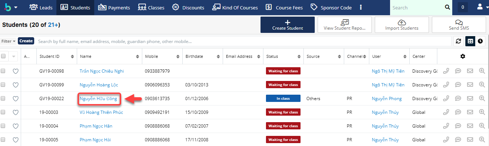

# Quản lí chuyển trung tâm, học phí, hoàn tiền

### Chuyển Trung Tâm


****:woman\_gesturing\_ok: **Lưu ý** :

Khi thực hiện chuyển trung tâm từ center A đến center B, bạn phải thực hiện :point\_right: [_**Delay**_ ](https://help.dotb.vn/bo-phan-giao-vu/quan-li-su-vu/quan-li-delay#hoc-vien-delay-khoi-lop) học viên A trước, sau đó [**Convert Payment**](../../admin-guide/drop-payment.md#convert-payment) sang Amount.

Nếu học viên không có Delay thì sẽ [Convert Payment](https://help.dotb.vn/admin-guide/drop-payment#convert-payment) sang **Amount**.

Cuối cùng sử dụng tính năng **Moving Center ** này để chuyển trung tâm A đến cho trung tâm B.


> Bước 1:Đưa chuột vào module Student ,chọn vào học viên có nhu cầu chuyển trung tâm hoặc có thể search tên học viên,số điện thoại,… trên thanh công cụ search.

> Bước 2: Tại màn hình Student, click vào action kế button edit chọn** Moving Center.**

> Bước 3: Tại màn hình chuyển trung tâm, chọn trung tâm học viên muốn chuyển đến (2) và những thông tin liên quan cần thiết như số giờ học viên còn lại và số tiền ở trung tâm hiện tại (1) và lí do chuyển center (3). Sau đó click **Save**.


****:woman\_gesturing\_ok: **Ghi chú:**

1:Thông tin gói học, số giờ remain và số tiền mà học viên còn lại ở hiện tại center hiện tại.

2:Trung tâm mà học viên muốn chuyển đến.

3\. Phí admin chuyển trung tâm

4: Thông tin trung tâm mới mà học viên lựa chọn chuyển tới..


> Bước 4: Hệ thống hiển thị thông tin chuyển trung tâm của học viên sau khi Save thành công.

### Chuyển nhượng học phí


****:woman\_gesturing\_ok: **Lưu ý** :

Khi thực hiện chuyển học phí từ học viên A đến học viên B, bạn phải thực hiện :point\_right: [_**Delay**_ ](https://help.dotb.vn/bo-phan-giao-vu/quan-li-su-vu/quan-li-delay#hoc-vien-delay-khoi-lop) học viên A trước (Nếu học viên đang học trong lớp ), sau đó [**Convert Payment**](../../admin-guide/drop-payment.md#convert-payment) sang Amount, cuối cùng sử dụng tính năng **Transfer Fee**  này để chuyển học phí đến cho học viên B.


> Bước 1: Đưa chuột vào module Student ,click vào học viên có nhu cầu chuyển nhượng học phí hoặc có thể search tên học viên,số điện thoại,… trên thanh công cụ search.

> Bước 2: Tại màn hình Student, click vào Menu Edit chọn Transfer Fee.

> Bước 3: Tại màn hình chuyển nhượng học phí, chọn học viên được nhận học phí (2) sau đó chọn loại học phí (delay, cashholder,deposit) muốn chuyển đến cho học viên B(1), nhập phí admin charge(3) và Lí do (4)  ,sau đó click **Save **để hoàn tất.


****:woman\_gesturing\_ok: **Ghi chú:**

1:Thông tin gói học còn lại (Remain hour/Remain Amount) mà học viên đã paid (delay, cashholder, deposit ).

2: Thông tin học viên được nhận học phí (học viên B) từ học viên A.

3\. Phí admin chuyển học viên từ A sang B (Nếu có).

4: Thông tin thêm được chuyển học phí .


> Bước 4: Hệ thống hiển thị thông tin chuyển chuyển nhượng học phí của học viên sau khi Save thành công.

### Hoàn tiền


****:woman\_gesturing\_ok: **Lưu ý** :

Khi thực hiện tính năng hoàn tiền cho học viên, bạn phải thực hiện :point\_right: [_**Delay**_ ](https://help.dotb.vn/bo-phan-giao-vu/quan-li-su-vu/quan-li-delay#hoc-vien-delay-khoi-lop) học viên trước (Nếu học viên đang học trong lớp)

Nếu học viên không có Delay thì sẽ [**Convert Payment**](https://help.dotb.vn/admin-guide/drop-payment#convert-payment) sang **Amount**.

Cuối cùng sử dụng tính năng **Refund **này để hoàn tiền cho học viên.


> Bước 1: Đưa chuột vào module **Student **,click vào học viên có nhu cầu hoàn tiền hoặc có thể search tên học viên,số điện thoại,… trên thanh công cụ search.

> Bước 2: Tại màn hình Student, click vào action kết button edit chọn **Refund**.

> Bước 3: Tại màn hình hoàn học phí, chọn loại học phí (delay,cashholder,deposit) (1) mà học viên muốn hoàn trả sau đó nhập số tiền charge phí giữ chổ học viên ở trung tâm (nếu có) (2), sau đó nhập thêm thông tin, lí do refund(4). Sau đó click **Save **để hoàn tất.


****:woman\_gesturing\_ok: **Ghi chú**:

1:Thông tin gói học còn lại (Remain hour/Remain Amount) mà học viên đã paid (delay, cashholder, deposit ).

2: Phí charge giữ chổ học viên (nếu có)

3: Số tiền học viên nhận refund.

4: Lí do, thông tin thêm về việc refund.


> Bước 4: Hệ thống hiển thị thông tin hoàn tiền của học viên sau khi **Save **thành công.

.png>)
