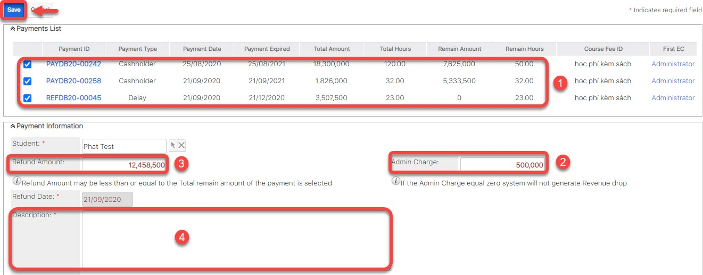

# Hoàn tiền


****:woman\_gesturing\_ok: **Lưu ý** :

Khi thực hiện tính năng hoàn tiền cho học viên, bạn phải thực hiện :point\_right: [_**Delay**_ ](https://help.dotb.vn/bo-phan-giao-vu/quan-li-su-vu/quan-li-delay#hoc-vien-delay-khoi-lop) học viên trước (Nếu học viên đang học trong lớp)

Nếu học viên không có Delay thì sẽ [**Convert Payment**](https://help.dotb.vn/admin-guide/drop-payment#convert-payment) sang **Amount**.

Cuối cùng sử dụng tính năng **Refund** này để hoàn tiền cho học viên.


> **Bước 1:** Ở màn hình danh sách của module **Student**, chọn vào học viên có nhu cầu hoàn tiền hoặc có thể search tên học viên,số điện thoại,… trên thanh công cụ search.

> **Bước 2:** Tại màn hình Student, click vào action kết button edit chọn **Refund**.

> **Bước 3:** Tại màn hình hoàn học phí, chọn loại học phí (delay,cashholder,deposit) (1) mà học viên muốn hoàn trả sau đó nhập số tiền charge phí giữ chổ học viên ở trung tâm (nếu có) (2), sau đó nhập thêm thông tin, lí do refund(4). Sau đó click **Save** để hoàn tất.


****:woman\_gesturing\_ok: **Ghi chú**:

1. Thông tin gói học còn lại (Remain hour/Remain Amount) mà học viên đã paid (delay, cashholder, deposit ).
2. Phí charge giữ chổ học viên (nếu có)
3. Số tiền học viên nhận refund.
4. Lí do, thông tin thêm về việc refund.


> **Bước 4:** Hệ thống hiển thị thông tin hoàn tiền của học viên sau khi **Save** thành công.

.png>)

> _Video hướng dẫn hoàn tiền học phí_


