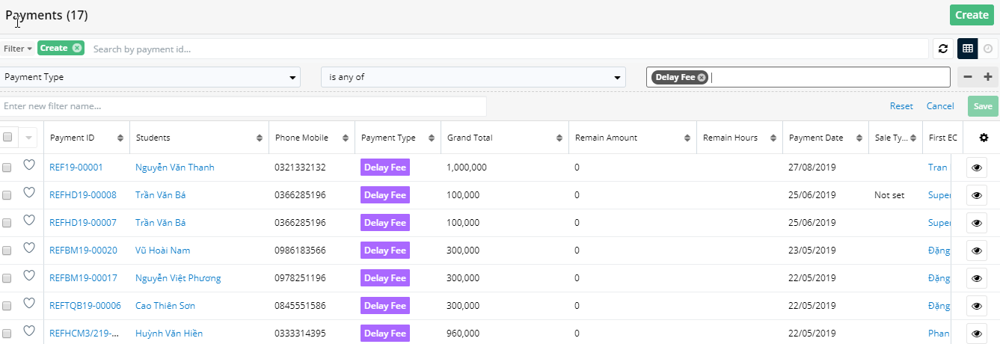
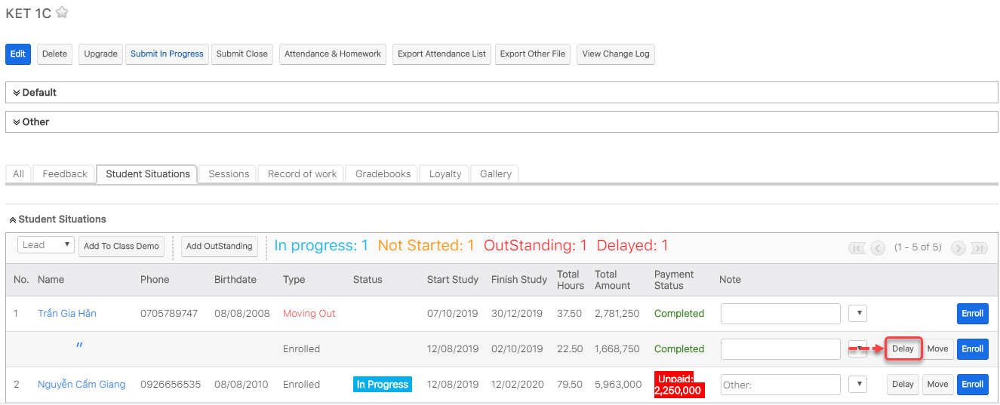
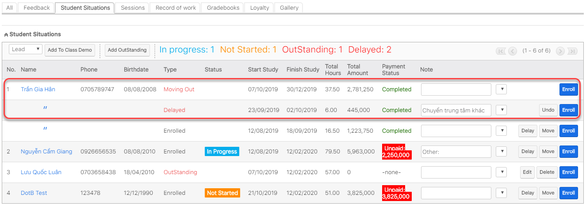
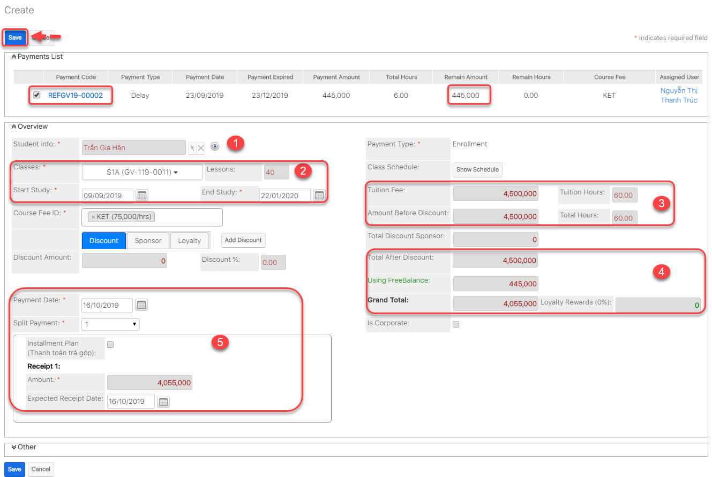
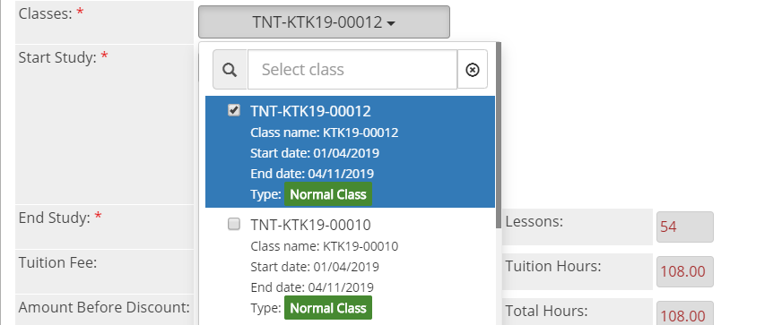
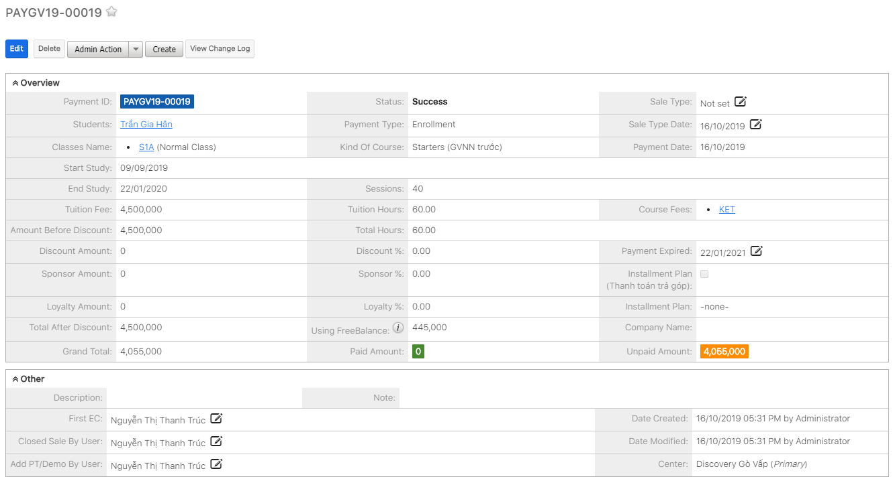

# Quản Lí Delay

## Quản lí phí Delay

### Xem danh sách học viên delay hoc phí

> Bước 1: 
Click chuột vào module Payments, tại Menu Action Filter click chọn **Create**.

> Bước 2: Tiếp theo click Payment Type.

> Bước 3: Chọn Type Payment là Delay Fee.

> Bước 4: Hệ thống sẽ load danh sách những học viên nào đang Delay học phí.

### Tạo phí Delay

> Bước 1: Đưa chuột vào Menu Payment chọn Create Payment.

> Bước 2: Tại màn hình tạo mới thanh toán, nhập đầy đủ các thông tin mà học viên đặt **Delay Fee**. Click **Save** để hoàn tất.


**Ghi chú:**

1: Lựa chọn Student. Các phương pháp lựa chọn Student:

Cách 1: Nhập tên vào ô Textbox sau đó Enter

 


Cách 2: Click vào biểu tượng  , 1 Popup xuất hiện, Tìm kiếm và lựa chọn Học sinh tương ứng.

2: Lựa chọn loại Payment là: **Delay Fee**

3: Nhập số tiền delay fee

4: Ngày thanh toán, Số lần thanh toán và Thông tin thanh toán


### Học viên Delay khỏi lớp

> Bước 1: Đưa chuột vào module Classes , click chọn lớp mà học viên muốn delay.

> Bước 2: Tại màn hình chi tiết Classes, Click tab Subpanel “Student Situations”.

> Bước 3: Click Delay.

> Bước 4: Tại màn hình Delay fee, nhập đầy đủ thông tin. Sau đó click Save để hoàn tất.


**Ghi chú**:

1: Thông tin học viên delay lớp.

2: Khoảng thời gian delay

3: Số dư của học viên.

4: Lý do delay.


> Bước 5: Kết quả.

### Re-enroll học viên vào lớp mới dùng tiền Delay

> Bước 1: Tại màn hình chi tiết Classes, tại tab Subpanel “Student Situations”,học viên đang có type là “Delayed” click enroll để Re-enroll học viên vào lớp.

> Bước 2: Tại màn hình tạo mới, chọn Payment đã có trước đó.

> Bước 3: Tại màn hình chi tiết Payment, nhập đầy đủ các thông tin cần thiết. Click Save để hoàn tất.


**Ghi chú:**

**1**: Lựa chọn Student. Các phương pháp lựa chọn Student:

Cách 1: Nhập tên vào ô Textbox sau đó Enter

 


Cách 2: Click vào biểu tượng  , 1 Popup xuất hiện, Tìm kiếm và lựa chọn Học sinh tương ứng.

**2**: Lựa chọn Classes. Có thể nhập tên Class hoặc lựa chọn Class trong danh sách và thời gian bắt đầu và kết thúc của Lớp học.

 

3: Học phí cho khóa học trước khi chưa có Discount hoặc tiền đặt cọc/Delay fee trước đó.

4: Học phí cho khóa học sau khi chưa có Discount hoặc tiền đặt cọc/Delay fee trước đó.

5: Thông tin về số lần thanh toán: Ngày thanh toán, tổng số tiền cần thanh toán cho lần enrollment này.


> Bước 4: Kết quả.

## 

