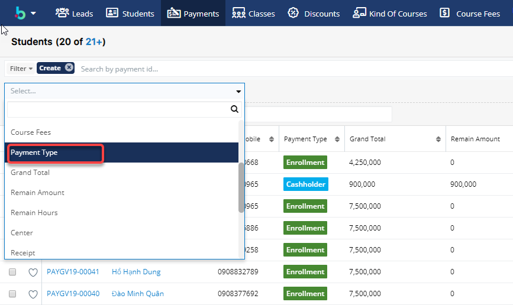
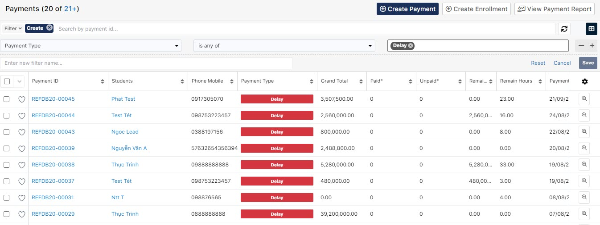
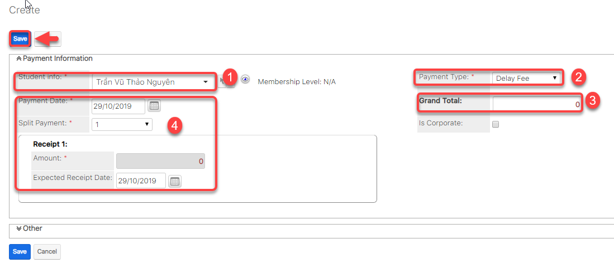

# Quản Lí Bảo Lưu (Delay)

### Xem danh sách học viên delay hoc phí

> Bước 1:&#x20;
> Click chuột vào module **Payments**, tại menu action filter click chọn **Create**.

> Bước 2: Tiếp theo click **Payment Type**.

> Bước 3: Chọn **Payment Type** là **Delay**.

> Bước 4: Hệ thống sẽ load danh sách những học viên nào đang Delay học phí.

### Tạo phí Delay (Charge Delay Fee)

> Bước 1: Đưa chuột vào Menu Payment chọn Create Payment.

> Bước 2: Tại màn hình tạo mới thanh toán, nhập đầy đủ các thông tin mà học viên đặt **Delay Fee**. Click **Save** để hoàn tất.


****:woman\_gesturing\_ok: **Ghi chú:**

1: Lựa chọn Student. Các phương pháp lựa chọn Student:

Cách 1: Nhập tên vào ô Textbox sau đó Enter

&#x20;


Cách 2: Click vào biểu tượng  , 1 Popup xuất hiện, Tìm kiếm và lựa chọn Học sinh tương ứng.

2: Lựa chọn loại Payment là: **Delay Fee**

3: Nhập số tiền delay fee

4: Ngày thanh toán, Số lần thanh toán và Thông tin thanh toán


### Học viên Delay (Bảo lưu)

> Bước 1: Đưa chuột vào module Classes , click chọn lớp mà học viên muốn delay.

> Bước 2: Tại màn hình chi tiết Classes, Click vào subpanel chọn tab “Student Situations” sau đó click button Delay.

> Bước 3: Tại màn hình Delay , nhập chọn thời gian mà học viên này bắt đầu delay, nhập lí do delay. Sau đó click Save để hoàn tất.

.png>)


****:woman\_gesturing\_ok: **Ghi chú**:

1: Thông tin học viên delay lớp.

2: Chọn thời gian bắt đầu Delay (Mặc định hệ thống sẽ lấy từ ngày user chọn ngày bắt đầu delay đến hết ngày kết thúc lớp học).&#x20;

3: Số dư của học viên trong khoảng thời gian Delay.

4: Lý do delay.


> Bước 4: Kết quả.

