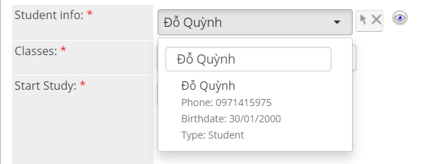

# Tạo phí Delay (Charge Delay Fee)


**Bao gồm 3 bước:**

**Bước 1:** Mở ra màn hình thêm mới Payment

**Bước 2:** Nhập đầy đủ thông tin cần thiết

**Bước 3:** Xem chi tiết màn hình Payment vừa tạo


> **Bước 1:** Ở màn hình danh sách của module **Payment** chọn Create Payment để mở ra màn hình tạo mới Payment.

<figure><figcaption></figcaption></figure>

> **Bước 2:** Tại màn hình tạo mới thanh toán, nhập đầy đủ các thông tin mà học viên có **Payment Type** là **Delay Fee**, sau đó nhấn **Save** để hoàn tất.

<figure><figcaption></figcaption></figure>


****:woman\_gesturing\_ok: **Ghi chú:**

1\. Lựa chọn Student. Các phương pháp lựa chọn Student:

Cách 1: Nhập tên vào ô Textbox sau đó Enter

&#x20;


Cách 2: Click vào biểu tượng , Popup xuất hiện sau đó tìm kiếm và lựa chọn học viên tương ứng.

2\. Lựa chọn loại Payment là: **Delay Fee**

3\. Nhập số tiền delay fee

4\. Ngày thanh toán, Số lần thanh toán và Thông tin thanh toán


> **Bước 3:** Thông tin chi tiết của Payment Delay Fee vừa tạo.

.png>)
