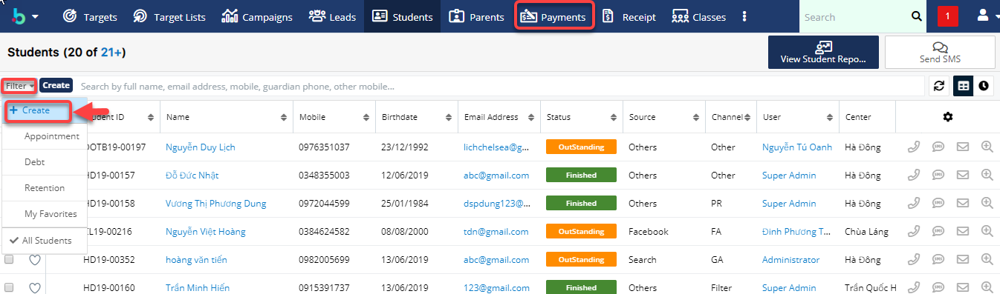

# Xem danh sách học viên delay học phí

> **Bước 1:**&#x20;
> Nhấn chuột vào phân hệ **Payments**, tại menu action filter click chọn **Create**.

> **Bước 2:** Tiếp theo chọn **Payment Type**.

> **Bước 3:** Chọn **Payment Type** là **Delay**.

> **Bước 4:** Hệ thống sẽ load danh sách những học viên nào đang Delay học phí.

