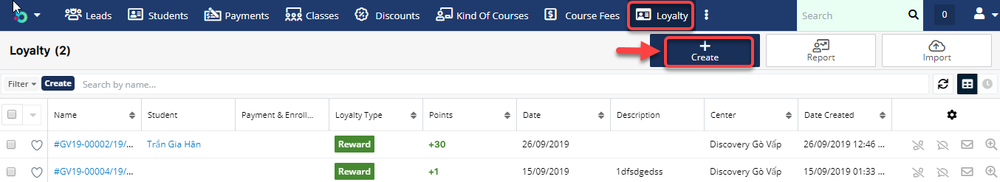

# Tích điểm Loyalty


:woman\_gesturing\_ok: Có 2 cách tích điểm Loyalty cho học viên

**Cách 1**: Học viên đi học, điểm danh mỗi buổi sẽ tích điểm cho học viên trong màn hình điểm danh cột **"Loyalty Point"**

**Cách 2:** Tích điểm khi học viên mua gói học hoặc Enroll vào lớp

**Cách 3**: User tạo điểm thưởng/trừ điểm học viên


#### Cách 1

> Chúng ta tích điểm dựa vào quá trình học làm bài tập về nhà, điểm danh của học viên trong màn hình **Attendance and Homework.**

<figure><figcaption></figcaption></figure>

#### Cách 2

> **Bước 1:** Với những chương trình học có đơn giá học phí áp dụng chính sách tích điểm cho học viên, user chỉ cần tick vào box "**Apply Loyalty Reward?**".

> **Bước 2:** Mỗi học viên nếu mua gói học (cashholder) với chương trình học có áp dụng tích điểm thì sẽ được tích 3% điểm dựa trên tổng số tiền  (gross) mà học viên đóng.

#### Cách 3

> **Bước 1:** Ở màn hình danh sách của module **Loyalty** chọn **Create Loyalty** để mở ra màn hình tạo mới **Loyalty**.

> **Bước 2:** Tại màn hình tạo mới **Loyalty**, nhập đầy đủ các thông tin cần thiết, sau đó chọn Save để hoàn tất .


****:woman\_gesturing\_ok: **Ghi chú:**

1. Loại Loyalty (Điểm giới thiệu, điểm thưởng, điểm trừ).
2. Số điểm cộng/trừ.
3. Chọn học viên cộng/trừ điểm.
4. Ngày cộng/trừ điểm.


> **Bước 3:** Hệ thống hiển thị thông tin chi tiết của Loyalty sau khi tạo thành công.

