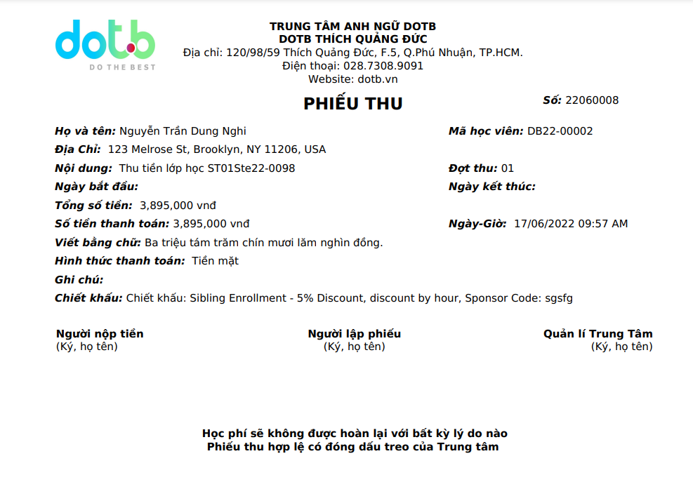

# Quản lý phiếu thu

> **Bước 1:** Ở màn hình danh sách của module **Payment**, chọn Payment muốn thức hiện việc xuất phiếu thu.

<figure><figcaption></figcaption></figure>

> **Bước 2:** Tại màn hình chi tiết của Payment, chọn tab subpanel “Receipts”, sau đó chọn Export để tiến hành xuất phiếu thu cho học viên.

<figure><figcaption></figcaption></figure>

> **Bước 3:** Kết quả sau khi thực hiện việc xuất phiếu thu cho học viên.

