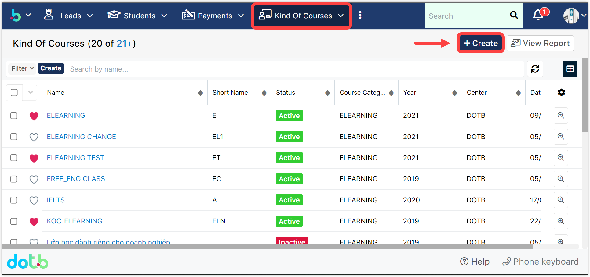
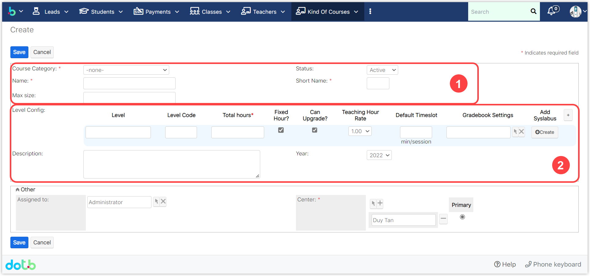
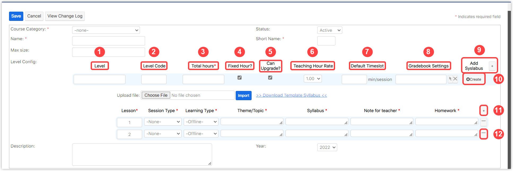

# Tạo chương trình học và giáo án theo từng buổi học.

## Phần 1: Tạo chương trình học

> **Bước 1:** Click chuột vào module **Kind of Courses**, sau đó chọn **Create**.

> **Bước 2:** Tại màn hình tạo mới Khóa học, nhập đầy đủ các thông tin cần thiết, sau đó click Save để hoàn tất việc tạo ra một khóa học mới.


🌤️ **Ghi chú:**

1: **** Tên chương trình học.

2: Cấu hình chương trình học và tạo giáo án theo từng buổi học (Phần 2 - Tạo giáo án theo từng buổi hoc).


## Phần 2: Tạo giáo án theo từng buổi học

> **Bước** 1**:** Tại màn hình T**ạo mới/Chỉnh sửa** chương trình học, nhập đầy đủ các thông tin cần thiết, Sau đó Click **Add Syllabus** để tạo giáo án cho 1 chương trình học mới.


️🌤️ **Ghi chú:**

1. **Level:** Cấp độ của chương trình học
2. **Level Code:** Mã viết tắt của Cấp độ chương trình học (Có thể bỏ trống)
3. **Total Hours:** Tổng số giờ của chương trình học theo giáo án
4. **Fixed Hours:** Giờ cố định (Không được thay đổi số giờ học cho lớp này (nếu tích vào))
5. **Can Upgrade?** :  Có thể Upgrade lên lớp mới.
6. **Teaching Hour Rate:** Tỉ lệ giờ giáo viên (chấm công theo hệ số giáo viên)
7. **Default Timeslot:** Thời lượng giảng dạy/Buổi học (Phút/Buổi)
8. **Gradebook Settings:** Thiết lập bảng điểm cho chương trình học
9. **Add Syslabus: T**hêm giáo án cho chương trình hoc
10. **Create:** Tạo giáo án cho lớp theo từng buổi học
11. Thêm bài học cho giáo án
12. Xoá bài học cho giáo án

