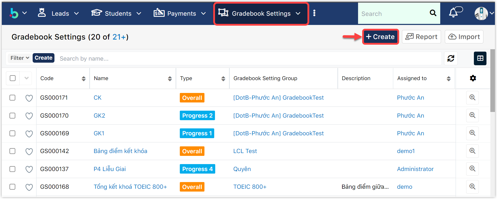
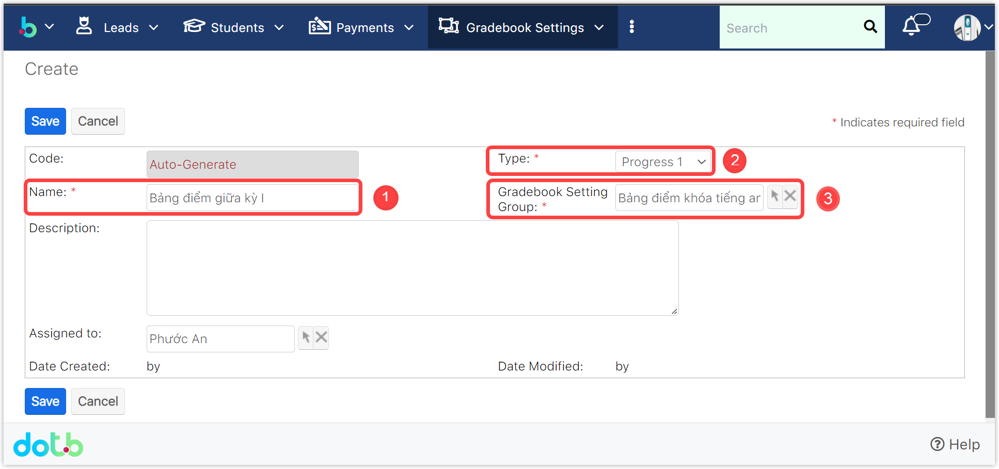

# Thiết lập cấu trúc bảng điểm

## Phần 1: Tạo nhóm cấu trúc bảng điểm

> **Bước 1:**
> Click chuột vào module **Gradebook Setting Groups**, sau đó click **Create** để tạo 1 nhóm cấu trúc bảng điểm mới.

.png>)

> **Bước 2:** Tại màn hình tạo nhóm cấu trúc bảng điểm, nhập tên nhóm cấu trúc bảng điểm (bắt buộc) và mô tả thêm (nếu có). Sau đó click **Save** để lưu lại.

.png>)

> **Bước 3:** Hệ thống hiển thị nhóm cấu trúc bảng điểm đã được tạo thành công. Sau đó, tiến hành tạo cấu trúc các bảng điểm cụ thể cho nhóm này (Phần 2).

.png>)

## Phần 2: Tạo cấu trúc bảng điểm

> **Bước 1:** Click chuột vào module **Gradebook Settings,** sau đó click **Create** để tạo mới 1 cấu trúc bảng điểm.

> **Bước 2:** Tại màn hình tạo cấu trúc bảng điểm, điền đầy đủ các thông tin cần thiết. Sau đó click **Save** để tạo.


🙆🏻**Ghi chú:**

1. Tên bảng điểm\*
2. Loại bảng điểm: Progress 1, Progress 2, Progress 3... Overall. Đây là cách để hệ thống tính toán ra được bảng điểm cuối cùng (nếu có nhiều các điểm thành phần)
3. Chọn nhóm cấu trúc bảng điểm của bảng điểm này.


> **Bước 3:** Sau khi tạo 1 cấu trúc bảng điểm, màn hình sẽ chuyển sang phần cấu hình chi tiết cho các cột điểm của bảng điểm. Tại đây, tiến hành định nghĩa bảng điểm theo chương trình học của trung tâm. Cuối cùng click **Save Setting.**


:woman\_gesturing\_ok: **Ghi chú:**

1: Cấp độ của chương trình học

2: Module áp dụng cho chương trình hoc

3: Số giờ của chương trình học theo giáo án

4: Giờ cố định (Không được thay đổi số giờ học cho lớp này(nếu tích vào))

5: Có thể Upgrade lên lớp mới.

6: Tỉ lệ giờ giáo viên (chấm công theo hệ số giáo viên)

7: Timeslot

8: URL document

9: Add Syslabus: thêm giáo án cho chương trình hoc

10: Double Click vào Create để lên giáo án cho lớp theo từng buổi học

11: Thêm bài học cho giáo án

12: Remove bài học cho giáo án


##
