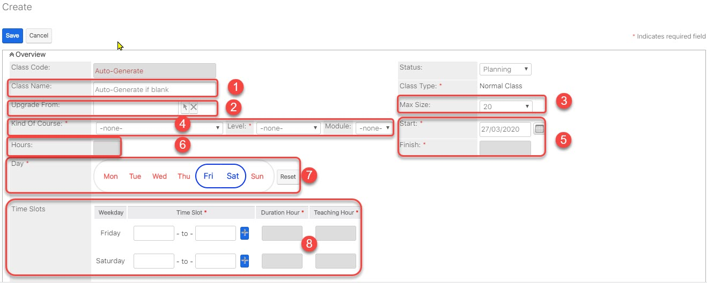
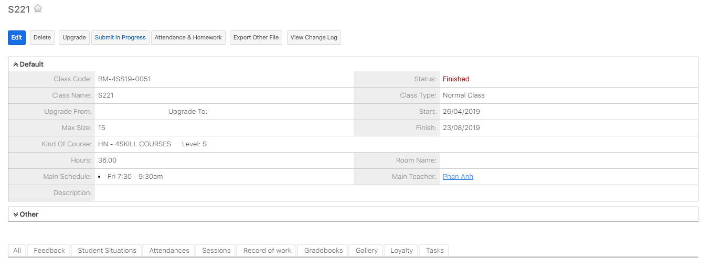
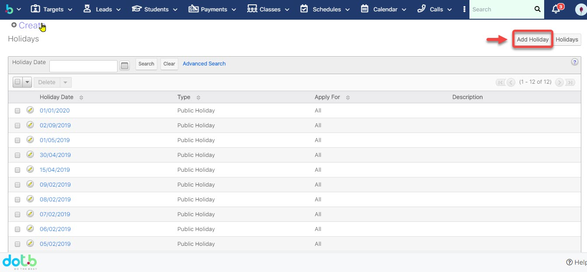

# 🏛 Tổ chức lớp học

## Tạo lớp học, lớp chờ

> Bước 1: Đưa chuột vào module Class chọn Create Class.

> Bước 2: Tại màn hình tạo mới Lớp học, nhập đầy đủ các thông tin cần thiết, Sau đó Click Save để Hoàn tất việc tạo ra 1 Lớp học mới.


****:woman\_gesturing\_ok: **Ghi chú:**

1: Tên của Lớp học, có thể để rỗng hệ thống sẽ tự động sinh ra tên Lớp.

2: Lựa chọn Lớp học muốn Upgrade lên lớp mới

3: Tổng số học sinh trong Lớp học

4: Lựa chọn Khóa học cho Lớp học

5: Thời gian bắt đầu và kết thúc của Lớp học

6: Tổng thời gian của Lớp học

7: Ngày học của Lớp học trong tuần

8\. Thời gian học tương ứng với ngày học của Lớp học


> Bước 3: Hệ thống hiển thị thông tin chi tiết của Lớp học sau khi tạo thành công.

## Hủy buổi học/chọn ngày học bù

> Bước 1: Click chuột vào module Classes, click chọn lớp mà Giáo viên đang dạy muốn hủy buổi học.

> Bước 2: 
> Tại màn hình Classes click vào Tab Session,hệ thống sẽ hiển thị lịch chi tiết giáo viên giảng dạy, click vào cancel để hủy buổi dạy của giáo viên (Nếu giáo viên nghỉ ốm hoặc lý do nào đó,…)

> Bước 3: Tại màn hình hủy buổi học,nhập thông tin lý do hủy lớp, chọn ngày dạy bù cho giáo viên


****:woman\_gesturing\_ok: **Ghi chú:**

1: Thông tin Lớp học bị hủy

2: Thông tin buổi học bị hủy và lý do hủy

****:man\_raising\_hand: **Lưu ý:**

\+ Nếu chọn Make up in this schedule thì hệ thống sẽ tư lên lịch dạy bù cho giáo viên vào buổi cuối cùng của tháng kết thúc khóa học

\+ Nếu chọn Make up in other Schedule bộ phận giáo vụ có thể xếp lịch dạy bù vào ngày mà giáo viên rảnh hoặc ngày mà giáo viên yêu cầu (3)


> Bước 4: Hệ thống hiển thị thông tin lớp bị hủy và ngày được chọn dạy bù cho học viên trong Session


****:woman\_gesturing\_ok: **Ghi chú**:

1:Trạng thái **Cancelled**: Buổi học đã được hủy trên hệ thống

2:Trạng thái **Make-up**: Buổi học được chọn cho giáo viên dạy bù (buổi dạy bù linh động cho người dùng tự set)


## Đổi ngày khai giảng

> Bước 1: Click chuột vào module Classes, click chọn Lớp mà bạn muốn đổi ngày khai giảng.

> Bước 2: Tại màn hình Classes click vào Edit.

> Bước 3: Tiếp theo click vào **Change Start Date** để thay đổi ngày khai giảng.

> Bước 4: Tại màn hình chỉnh sửa ngày khai giảng, nhập đầy đủ các thông tin cần thiết. Sau đó click Save để hoàn tất.

.png>)


****:woman\_gesturing\_ok: **Ghi chú:**

1: Chọn ngày khai giảng muốn thay đổi.

2: Lý do thay đổi ngày khai giảng và có thể đổi lại lịch học mới (nếu muốn).

3: Lịch học gần đây của lớp được tạo.



****:man\_raising\_hand: **Lưu ý:** Khi thay đổi ngày khai giảng (**Change Start Date**), tất cả các dữ liệu điểm danh của các buổi học đều sẽ bị mất.


## Đổi lịch học trong khoảng thời gian bất kì

> Bước 1: Click chuột vào module Classes ,sau đó click chọn lớp muốn đổi lịch học.

> Bước 2: Tại màn hình Lớp, click chọn Edit.

> Bước 3: Tiếp theo click vào **Change Schedule** để thay đổi lịch học.

.png>)

> Bước 4: Nhập đầy đủ thông tin, sau đó click **Save** để hoàn tất.


****:woman\_gesturing\_ok: **Ghi chú**:

1: Chọn khoảng thời gian thay đổi lịch học

2: Lý do thay đổi lịch học

3: Đổi lại lịch học mới (nếu có)



****:man\_raising\_hand: **Lưu ý:** Khi thay đổi lịch học trong khoảng thời gian bất kỳ, dữ liệu điểm danh của các buổi học trong khoảng thời gian thay đổi sẽ bị mất.


## Quản lí lịch nghỉ lễ trong năm

> Bước 1: Đưa chuột vào proflie, sau đó click chọn **Admin.**

> Bước 2: Tại màn hình Admin, click chọn **Public Holiday.**

> Bước 3: Tại màn hình Holidays, click chọn **Add Holiday.**

> Bước 4: Sau đó chọn ngày cần set up Holiday, click **Save** để hoàn tất.

