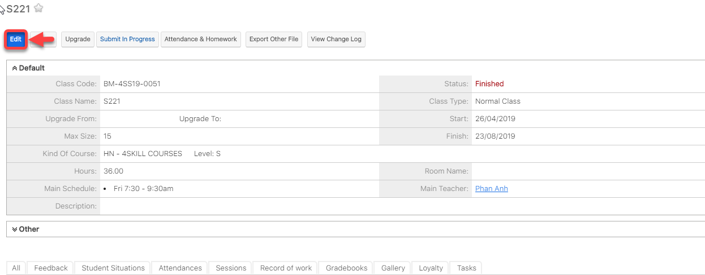

# Đổi lịch học trong khoảng thời gian bất kì

> **Bước 1:** Ở màn hình danh sách của module **Classes**, sau đó chọn lớp muốn đổi lịch học.

> **Bước 2:** Tại màn hình Lớp, click chọn Edit.

> **Bước 3:** Tiếp theo chọn vào Change Schedule để thay đổi lịch học.

.png>)

> **Bước 4:** Nhập đầy đủ thông tin, sau đó chọn **Save** để hoàn tất.


****:woman\_gesturing\_ok: **Ghi chú**:

1. Chọn khoảng thời gian thay đổi lịch học.
2. Lý do thay đổi lịch học.
3. Đổi lại lịch học mới (nếu có).



:man\_raising\_hand: **Lưu ý:** Khi thay đổi lịch học trong khoảng thời gian bất kỳ, dữ liệu điểm danh của các buổi học trong khoảng thời gian thay đổi sẽ bị mất.


> _Video hướng dẫn Đổi ngày khai giảng - Đổi lịch lớp_


