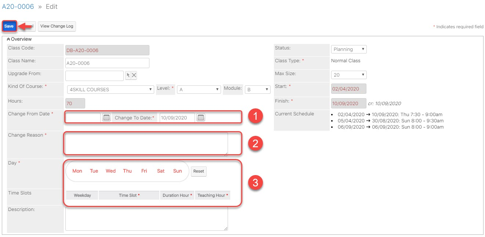

# Đổi lịch học trong khoảng thời gian bất kì

> Bước 1: Click chuột vào module Classes, sau đó click chọn lớp muốn đổi lịch học.

> Bước 2: Tại màn hình Lớp, click chọn Edit.

> Bước 3: Tiếp theo click vào Change Schedule để thay đổi lịch học.

> Bước 4: Nhập đầy đủ thông tin, sau đó click **Save** để hoàn tất.


\*\*\*\*🙆♀ **Ghi chú**:

1: Chọn khoảng thời gian thay đổi lịch học

2: Lý do thay đổi lịch học

3: Đổi lại lịch học mới \(nếu có\)



🙋♂ **Lưu ý:** Khi thay đổi lịch học trong khoảng thời gian bất kỳ, dữ liệu điểm danh của các buổi học trong khoảng thời gian thay đổi sẽ bị mất.


