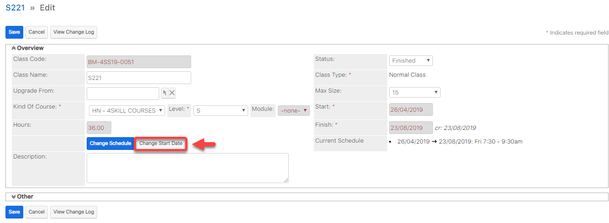

# Đổi ngày khai giảng

> Bước 1: Click chuột vào module Classes, click chọn Lớp mà bạn muốn đổi ngày khai giảng.

> Bước 2: Tại màn hình Classes click vào Edit.

> Bước 3: Tiếp theo click vào Change Start Date để thay đổi ngày khai giảng.

> Bước 4: Tại màn hình chỉnh sửa ngày khai giảng, nhập đầy đủ các thông tin cần thiết. Sau đó click Save để hoàn tất.

.png>)


****:woman_gesturing_ok: **Ghi chú:**

1: Chọn ngày khai giảng muốn thay đổi.

2: Lý do thay đổi ngày khai giảng và có thể đổi lại lịch học mới (nếu muốn).

3: Lịch học gần đây của lớp được tạo.



****:man_raising_hand: **Lưu ý: **Khi thay đổi ngày khai giảng (Change Start Date), tất cả các dữ liệu điểm danh của các buổi học đều sẽ bị mất

