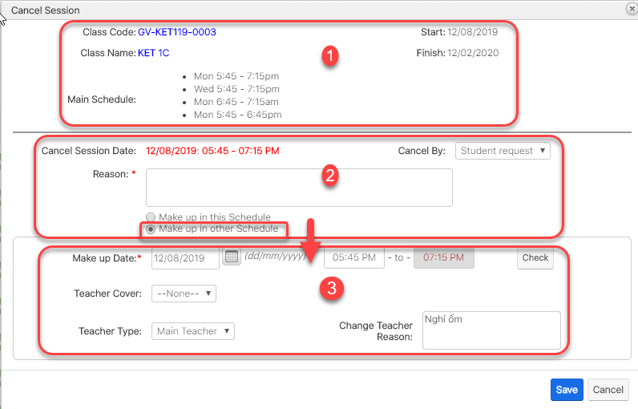

# Hủy buổi học/chọn ngày học bù

> Bước 1: Click chuột vào module Classes, click chọn lớp mà Giáo viên đang dạy muốn hủy buổi học.

> Bước 2: 
Tại màn hình Classes click vào Tab Session,hệ thống sẽ hiển thị lịch chi tiết giáo viên giảng dạy, click vào cancel để hủy buổi dạy của giáo viên \(Nếu giáo viên nghỉ ốm hoặc lý do nào đó,…\)

> Bước 3: Tại màn hình hủy buổi học,nhập thông tin lý do hủy lớp, chọn ngày dạy bù cho giáo viên


\*\*\*\*🙆♀ **Ghi chú:**

1: Thông tin Lớp học bị hủy

2: Thông tin buổi học bị hủy và lý do hủy

\*\*\*\*🙋♂ **Lưu ý:**

+ Nếu chọn Make up in this schedule thì hệ thống sẽ tư lên lịch dạy bù cho giáo viên vào buổi cuối cùng của tháng kết thúc khóa học

+ Nếu chọn Make up in other Schedule bộ phận giáo vụ có thể xếp lịch dạy bù vào ngày mà giáo viên rảnh hoặc ngày mà giáo viên yêu cầu \(3\)


> Bước 4: Hệ thống hiển thị thông tin lớp bị hủy và ngày được chọn dạy bù cho học viên trong Session


\*\*\*\*🙆♀ **Ghi chú**:

1: Trạng thái **Cancelled**: Buổi học đã được hủy trên hệ thống

2: Trạng thái **Make-up**: Buổi học được chọn cho giáo viên dạy bù \(buổi dạy bù linh động cho người dùng tự set\)


