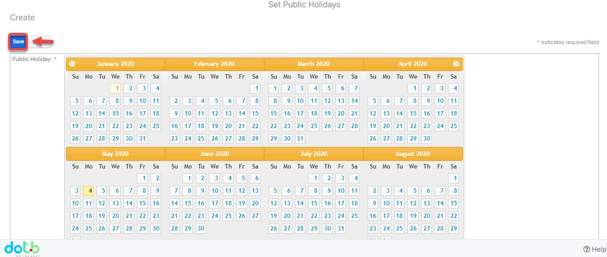

# Quản lý lịch nghỉ lễ trong năm

> **Bước 1:** Đưa chuột vào profile, sau đó click chọn **Admin.**

> **Bước 2:** Tại màn hình Admin, nhấn chọn **Public Holiday.**

> **Bước 3:** Tại màn hình Holidays, chọn **Add Holiday.**

> **Bước 4:** Sau đó chọn ngày cần set up Holiday, nhấn **Save** để hoàn tất.

> _Video hướng dẫn Quản lý lịch nghỉ lễ trong năm_


