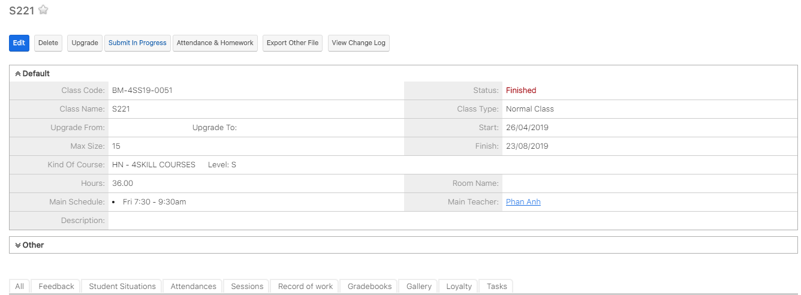

# Tạo lớp học, lớp chờ

> **Bước 1:** Ở màn hình danh sách của module **Classes,** chọn **Create Class** để mở ra màn hình tạo mới lớp.

<figure><figcaption></figcaption></figure>

> **Bước 2:** Tại màn hình tạo mới Lớp học, nhập đầy đủ các thông tin cần thiết, Sau đó chọn Save để hoàn tất việc tạo ra 1 lớp học mới.

<figure><figcaption></figcaption></figure>


****:woman\_gesturing\_ok: **Ghi chú:**

1. Tên của Lớp học, có thể để rỗng hệ thống sẽ tự động sinh ra tên lớp.
2. Lựa chọn Lớp học muốn Upgrade lên lớp mới.
3. Thời gian bắt đầu và kết thúc của Lớp học.
4. Lựa chọn Khóa học cho Lớp học.
5. Tổng số học sinh trong Lớp học.
6. Tổng thời gian của Lớp học.
7. Ngày học của Lớp học trong tuần.
8. Thời gian học tương ứng với ngày học của Lớp học.


> **Bước 3:** Nhập thông tin cấu hình Class In.

> **Bước 4:** Hệ thống hiển thị thông tin chi tiết của Lớp học sau khi tạo thành công.


Lưu ý : Để bật đồng bộ Lớp qua Class In, chọn trạng thái Online là Active.


> _Video hướng dẫn Tạo mới lớp học_


