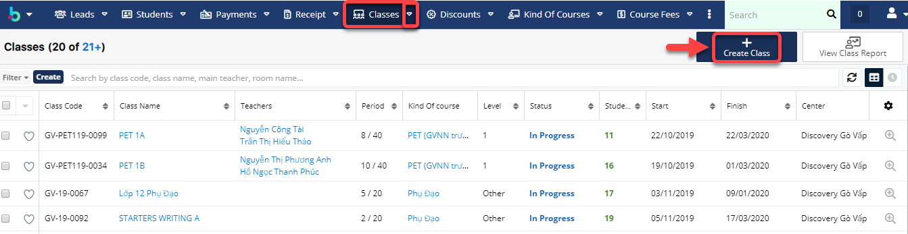

# Tạo lớp học, lớp chờ

> Bước 1: Đưa chuột vào module Class chọn Create Class.

> Bước 2: Tại màn hình tạo mới Lớp học, nhập đầy đủ các thông tin cần thiết, Sau đó Click Save để Hoàn tất việc tạo ra 1 Lớp học mới.


****:woman_gesturing_ok: **Ghi chú:**

1: Tên của Lớp học, có thể để rỗng hệ thống sẽ tự động sinh ra tên Lớp.

2: Lựa chọn Lớp học muốn Upgrade lên lớp mới

3: Tổng số học sinh trong Lớp học

4: Lựa chọn Khóa học cho Lớp học

5: Thời gian bắt đầu và kết thúc của Lớp học

6: Tổng thời gian của Lớp học

7: Ngày học của Lớp học trong tuần

8\. Thời gian học tương ứng với ngày học của Lớp học


> Bước 3: Hệ thống hiển thị thông tin chi tiết của Lớp học sau khi tạo thành công.

##
