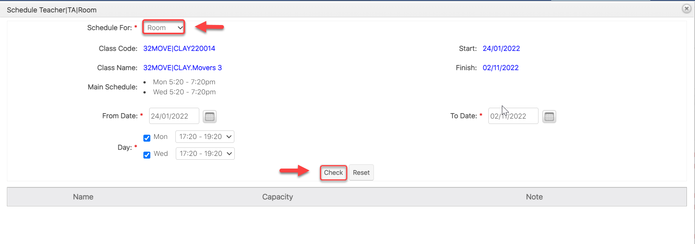
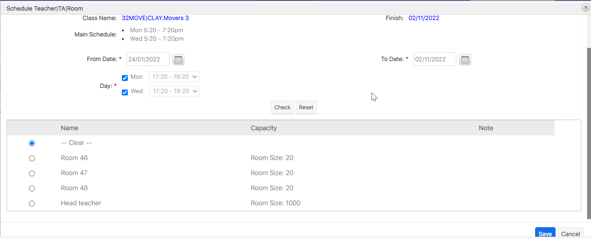
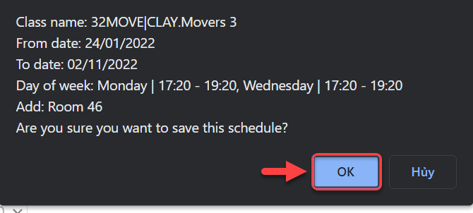

# Tạo phòng học - Xếp phòng

## Tạo phòng học (Class In: Teacher)

Room được tạo trên EMS được xem như 1 account Teacher bên ClassIn

> **Bước 1:** Ở màn hình danh sách của module **Room**, ta nhấn vào button **Create Room** để mở ra màn hình thêm mới Room.

<figure><figcaption></figcaption></figure>

> **Bước 2:** Nhập thông tin **Room (Online/offline)** và nhập đầy đủ thông tin cấu hình. Cuối cùng, chúng ta nhấn Save để lưu lại.

<figure><figcaption></figcaption></figure>


**Ghi chú:** :tada:

1. Nhập tên Room (Class In Teacher)
2. Chọn loại Room cần cấu hình (Online/Offline)
3. Chọn chi nhánh cần cấu hình Room.
4. Chọn loại User cần cấu hình cho Room: (Teacher users/Head Teacher/Regular User)

Class In: Teacher -> Chọn từ Room (Loại: Teacher User, Head Teacher)

Class In: Head Teacher -> Mặc định từ Room (Loại: Head Teacher) Lớp tạo ra trên hệ thống sẽ set mặc định 1 Head Teacher

Class In: Assistant -> Chọn từ Room (Loại: Teacher User, Head Teacher)

Class In: Auditer -> Chọn từ Room (Loại: Regular User)


> **Bước 3:** Hệ thống hiển thị thông tin chi tiết của **Rooms** được tạo.

<figure><figcaption></figcaption></figure>

## Xếp phòng

Xếp phòng thì hệ thống mới tạo được lesson và đồng bộ qua Class in thông tin đó khi bật Active trong lớp(Class - EMS), trên Class In Lớp(course) phải có trước đó.

> **Bước 1:** Ở màn hình danh sách của module **Classes**, sau đó chọn lớp mà bạn muốn xếp phòng giảng dạy cho Giáo viên.

<figure><figcaption></figcaption></figure>

> **Bước 2:**&#x20;
> Tại màn hình chi tiết của Lớp học, nhấn vào tab **Sessions,** sau đó nhấn vào **Schedule Teacher/TA/Room.**

> **Bước 3:**&#x20;
> Tại màn hình lựa chọn các tiêu chí để xếp lịch cho Room, sau đó chọn vào button **Check**.

> **Bước 4:**&#x20;
> Hệ thống hiển thị danh sách Room phù hợp, chọn Room muốn xếp, chọn **Save** để hoàn  tất.

> **Bước 5:** Nhấn OK để xác nhận việc xếp Room là thành công.

> _Video hướng dẫn tạo phòng học và xếp phòng_


