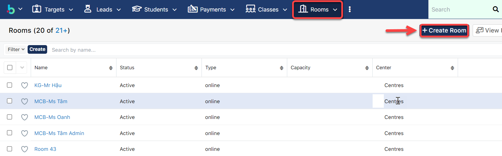
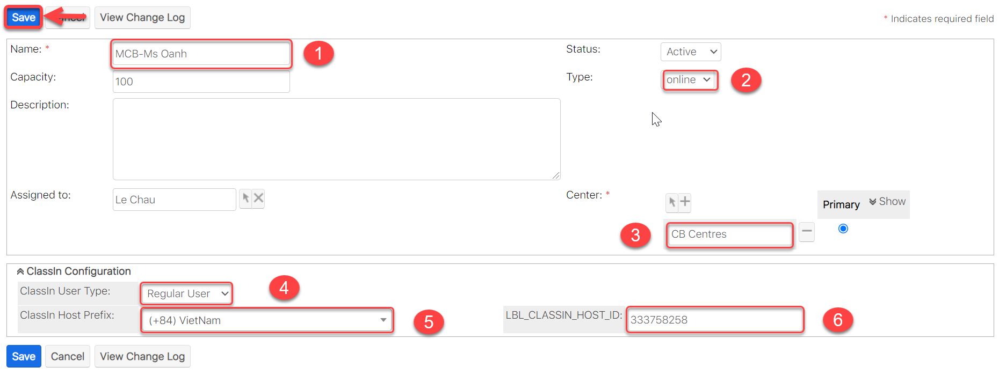

# Tạo Room (Class In: Teacher)

> **Bước 1:** Vào phân hệ Room, sau đó chọn Create Room.

> **Bước 2:** Nhập thông tin Room (Online/offline) và nhập thông tin cấu hình. Cuối cùng click Save.


Ghi chú :tada:

1.Nhập tên Room (Class In Teacher)

2.Chọn loại Room cần cấu hình (Online/Offline)

3.Chọn chi nhánh cần cấu hình Room.

4.Chọn loại User cần cấu hình cho Room: (Teacher users/Head Teacher/Regular User)

* Class In: Teacher -> Chọn từ Room (Loại: Teacher User, Head Teacher)
* Class In: Head Teacher -> Mặc định từ Room (Loại: Head Teacher) Lớp tạo ra trên hệ thống sẽ set mặc định 1 Head Teacher
* Class In: Assistant -> Chọn từ Room (Loại: Teacher User, Head Teacher)
* Class In: Auditer -> Chọn từ Room (Loại: Regular User)

