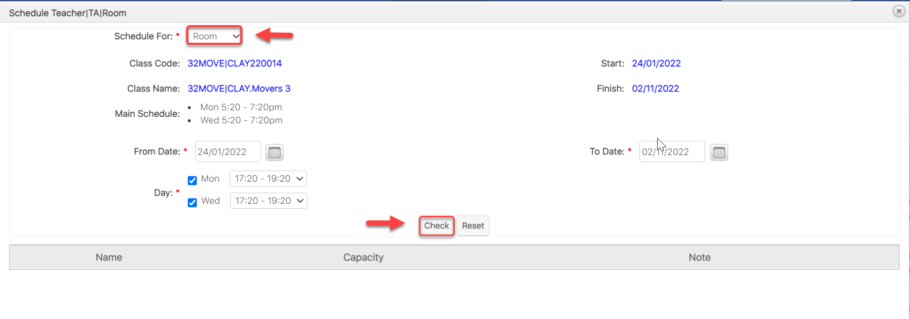
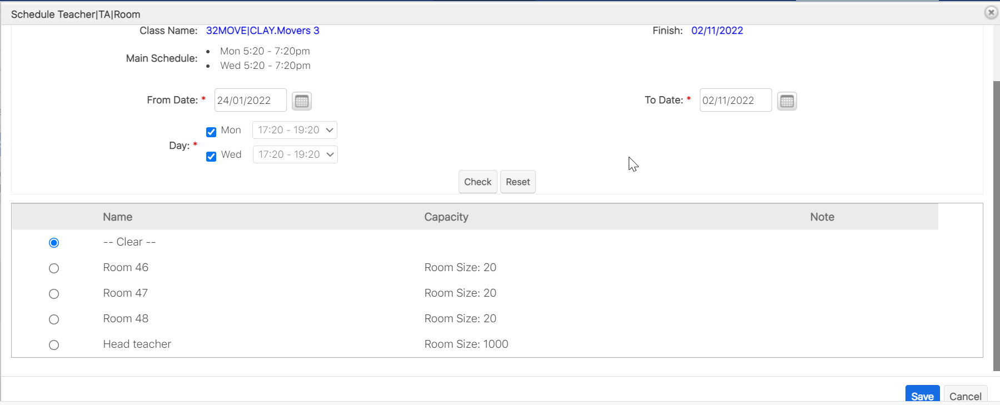
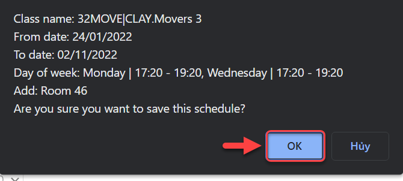

# Xếp Room

> Bước 1: Click chuột vào module Class, sau đó chọn lớp mà muốn xếp Room giảng dạy cho Giáo viên.

> Bước 2:&#x20;
> Tại màn hình chi tiết của Lớp học, Click vào tab **Sessions,** sau đó click vào **Schedule Teacher/TA/Room**

> Bước 3:&#x20;
> Tại màn hình lựa chọn các tiêu chí để xếp lịch cho Room, sau đó Click vào button **Check**.

> Bước 4:&#x20;
> &#x20;Hệ thống hiển thị danh sách Room phù hợp, click chọn Room muốn xếp, click **Save** để hoàn  tất.

> Bước 5: Click OK để xác nhận việc xếp Room là thành công.

##
