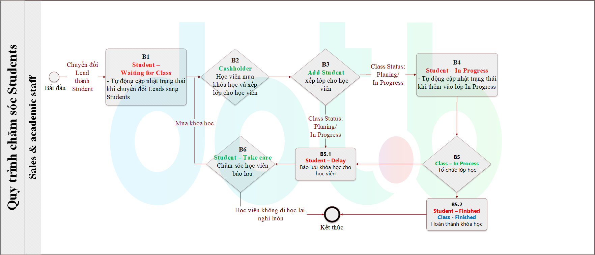
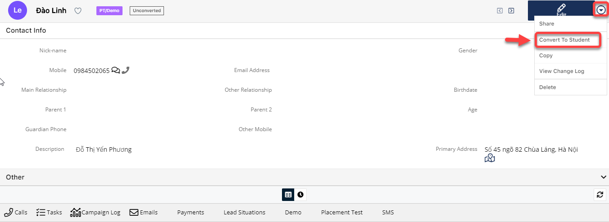
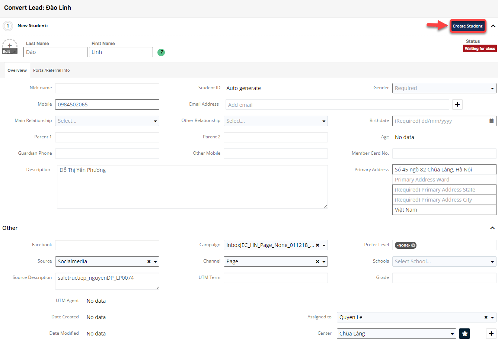
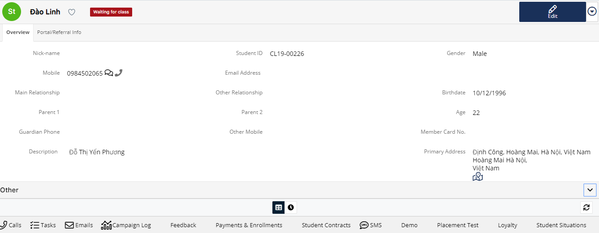

# Cập nhật cho Edu Hàng tháng

> **Chi tiết  các trạng thái học viên :**
>
> **+ Waiting for class:** Đã được convert lên thành học viên.
>
> **+ In Progress:**  Đã xếp học viên vào lớp.
>
> **+ Delay :** Khi thực hiện thao tác ****bảo lưu.
>
> **+ Finished :** Hoàn tất việc học.

## Convert to Student

> Bước 1: Click chuột vào module Leads , chọn Lead muốn chuyển đổi thành HV chính thức.

> Bước 2: 
Tại màn hình thông tin chi tiết của Lead, click **Convert to Student** để chuyển đổi HV chính thức.

> Bước 3: Hệ thống chuyển sang màn hình tạo mới Student, nhập thông tin yêu cầu, click “Create Student” hoàn tất chuyển đổi.

> Bước 4: Hệ thống hiển thị thông tin Student mới được tạo. Trạng thái của Student sẽ là Waiting to class. Đồng thời, trạng thái của Leads sẽ được cập nhật là Completed.

