# Inventory

## Book/Gift

> Bước 1: Click chuột vào module Admin chọn Admin.

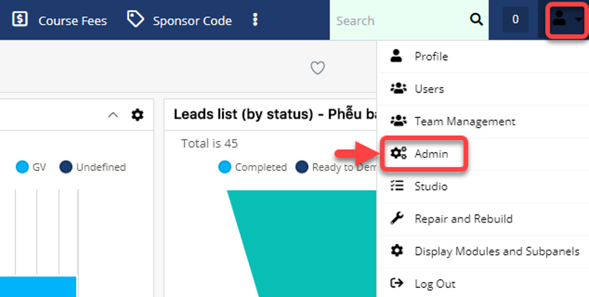

> Bước 2: Tại màn hình admin ,chọn Book/Gift.

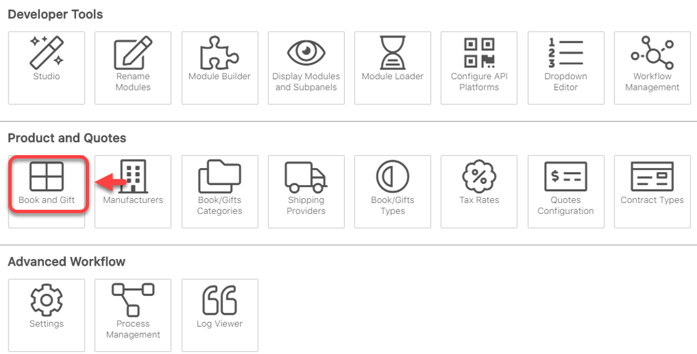

> Bước 3: Tại màn hình Book and Gift, click chọn Create Book/Gift.

> Bước 3: Tại màn hình tao mới Book/Gift, nhập đầy đủ thông tin .Sau đó click Save.


**Ghi chú:**

1:Tên sách và mã sách

2:Đơn giá và ngày sách nhập/xuất về kho

3:Thể loại và tên danh mục

4:Đơn vị \(Unit hay set\)


> Bước 4: Hệ thống hiển thị thông tin Book/Gift khiSave thành công.

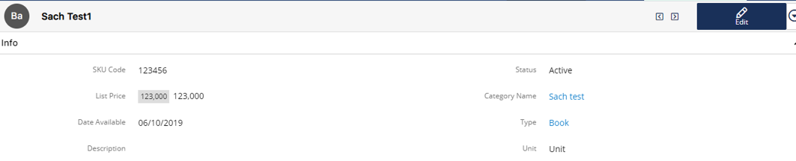

## Category Book/gift 

> Bước 1: Đưa chuột vào module Admin chọn Admin.

> Bước 2 : Tại màn hình Admin click vào chọn Book/Gift Categories.

> Bước 3: Tại màn hình Book/Gift Categories,Click Create.

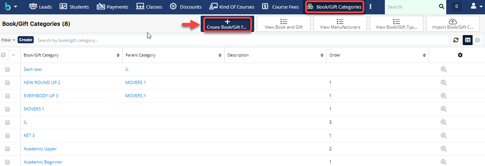

> Bước 4:

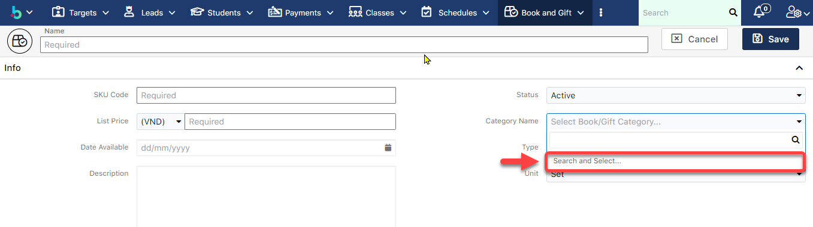

> Bước 5: Tại màn hình Book/Gift Categories, click Create.

> Bước 6: Tại màn hình tao mới Book/Gift Categories, nhập đầy đủ thông tin .Sau đó click Save.

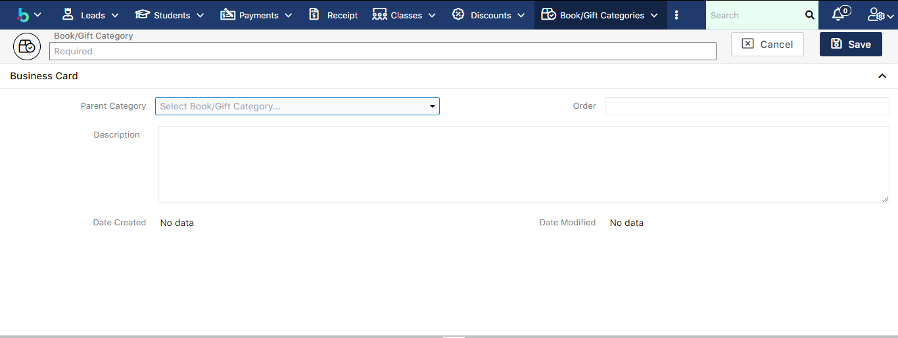

> Bước 7: Hệ thống hiển thị thông tin Book/Gift Categories khi Save thành công.

## Book/Gift Type

> Bước 1: Đưa chuột vào Menu chọn Admin.Tại màn hình Admin click vào chọn Book/Gift Types.

> Bước 2: Tại màn hình Admin click vào chọn Book/Gift Types.

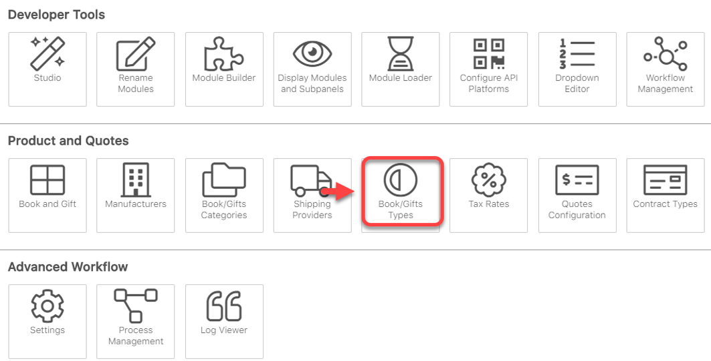

> Bước 3: Tại màn hình Book/Gift Types,Click vào Menu chọn Create Book/Gift Types.

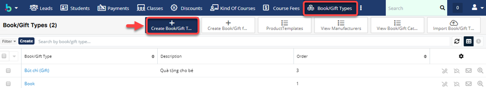

> Bước 4: Tại màn hình Book/Gift Types, nhập đầy đủ thông tin .Sau đó click Save.


Ghi chú:

1::Tên loại Book/Gift 

2:Order : Độ ưu tiên \(Loại hay sử dụng hoặc quan trọng để số1\)


> Bước 5: Hệ thống hiển thị thông tin Book/Gift Types khi Save thành công.

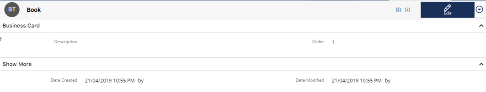

## Inventory

> Bước 1: Click chuột vào module Inventory. Chọn Create.

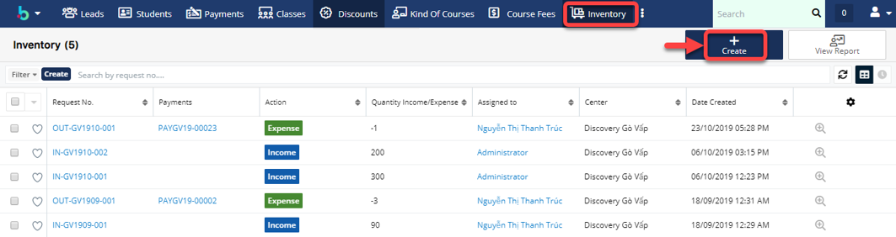

> Bước 2: Tại màn hình tao mới,nhập đầy đủ thông tin .Sau đó click Save.

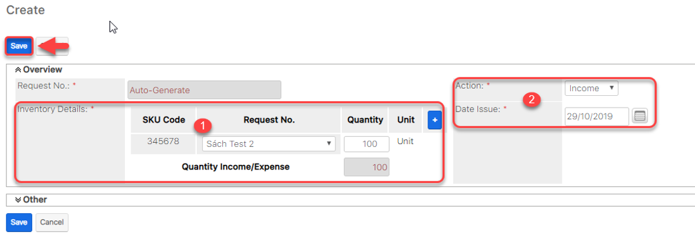


Ghi chú:

1:Thông tin sản phẩm \(mã,tên,số lượng,đơn vị\)

2:Ngày nhập sản phẩm và thông tin \(Income : nhập sản phẩm vào, Expense : xuất sản phẩm ra bên ngoài\).


> Bước 3: Hệ thống hiển thị thông tin sau khi Save thành công.

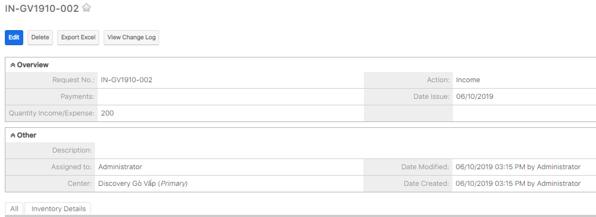

