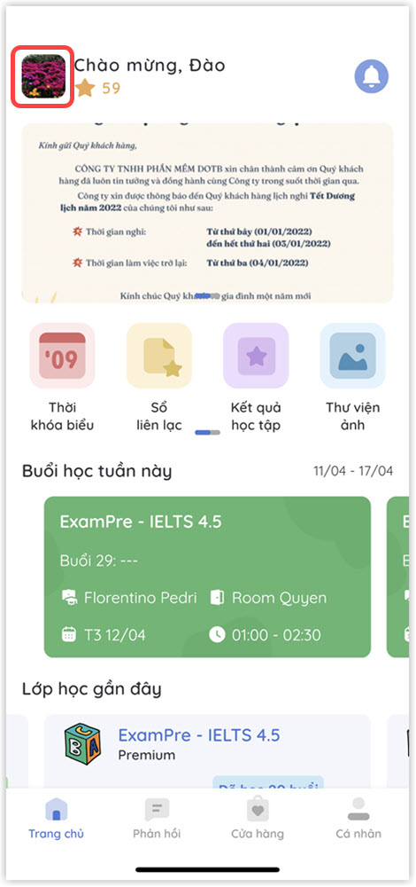

# Cài đặt ngôn ngữ

#### &#x20;Có 2 cách để thay đổi ngôn ngữ ứng dụng:

> **CÁCH 1:  TRƯỚC KHI ĐĂNG NHẬP**
>
> **Bước 1:** Tại màn hình chọn Vai trò, người dùng nhấp vào **ô hình chữ nhật** như hình bên dưới để thay đổi ngôn ngữ.

.jpg>)

> **Bước 2:** Tại đây, người dùng có thể lựa chọn ngôn ngữ mà mình muốn thay đổi.

.jpg>)

> **Bước 3:** Sau khi đổi ngôn ngữ xong, ứng dụng sẽ có giao diện như sau.

.jpg>)

> **CÁCH 2: SAU KHI ĐĂNG NHẬP**
>
> **Bước 1:** Tại màn hình **Trang chủ**, click vào icon avatar để hiển thị danh sách chức năng của ứng dụng.

> **Bước 2:** Chọn chức năng **Cài đặt** trên ứng dụng.

.jpg>)

> **Bước 3:** Chọn chức năng **Ngôn ngữ** trên ứng dụng.

.jpg>)

> **Bước 4:** Người dùng lựa chọn ngôn ngữ muốn thay đổi.

.jpg>)

> **Bước 5:** Ứng dụng sau khi cập nhật ngôn ngữ sẽ có giao diện như sau.

.jpg>)
