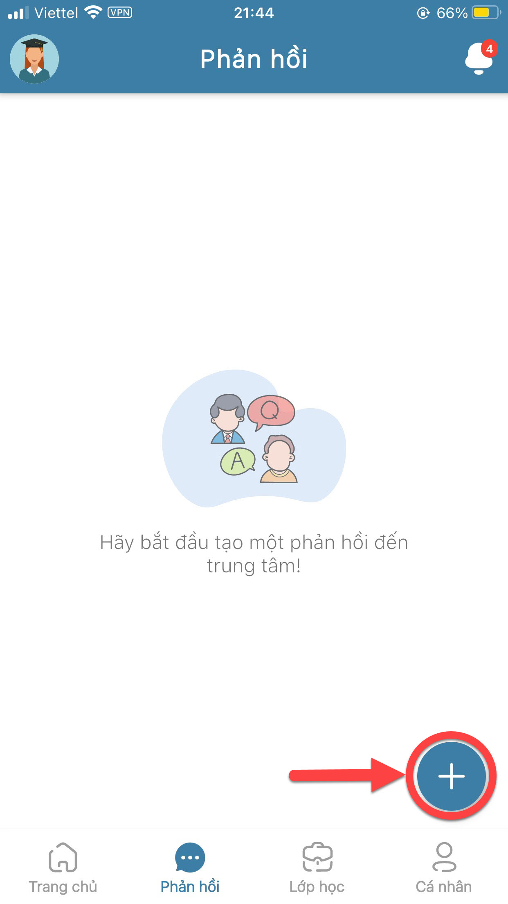
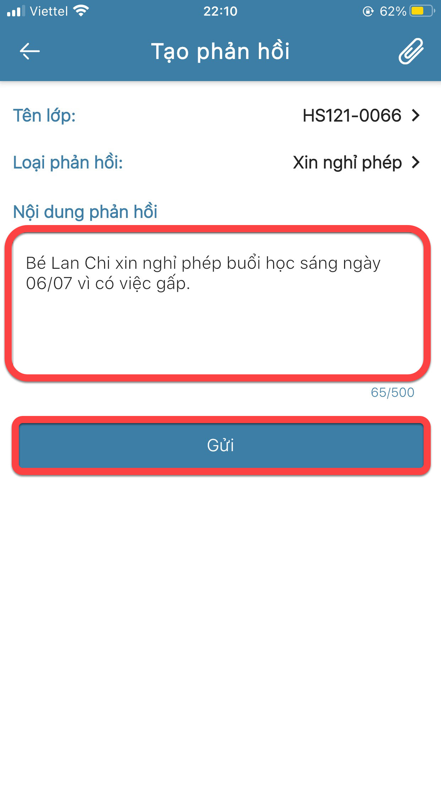
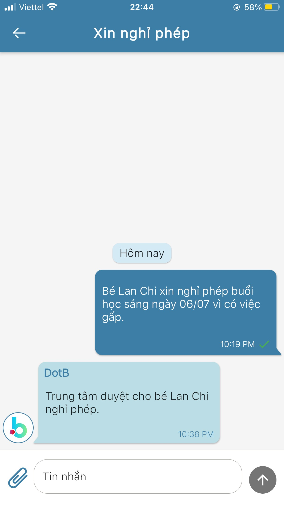
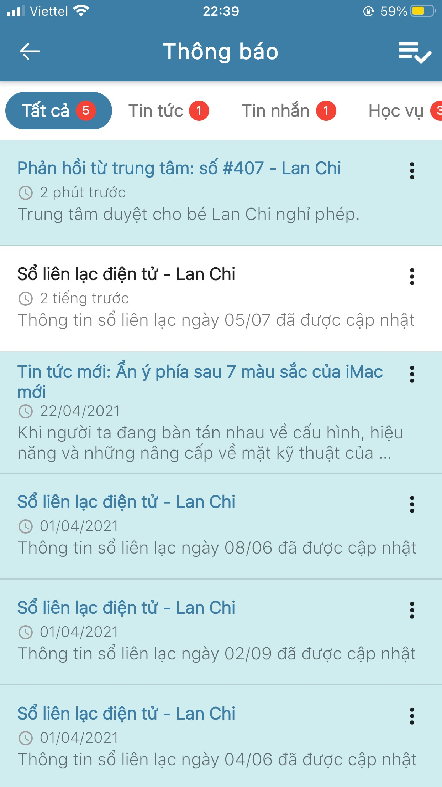

# Ghi nhận phản hồi

> Bước 1: Tại màn hình Trang chủ, click vào chức năng Phản hồi để phản hồi về trung tâm.

.jpg>)

> Bước 2: Click vào biểu tượng dấu cộng góc phải dưới cùng để tạo mới Phản hồi.

> Bước 3: Chọn 1 trong 2 loại Phản hồi cần thực hiện. Click chọn option Tạo phản hồi.

.jpg>)


Ghi chú:

1. Liên hệ trực tiếp: Gọi điện trực tiếp đến hotline trung tâm.
2. Tạo phản hồi: Phản hồi dưới dạng gửi văn bản đến trung tâm


> Bước 4: Chọn Loại phản hồi.

.jpg>)


Ghi chú: 

.jpg>)

* Loại yêu cầu: 

\- Xin nghỉ phép (Học viên trao đổi với Trung tâm về việc vắng học).

\- Hỏi lịch học (Học viên trao đổi với Trung tâm về vấn đề Lịch học).

\- Hỏi học phí (Học viên trao đổi với Trung tâm về vấn đề Học phí).

\- Khác (Những trao đổi khác với 3 nội dung trên).


> Bước 5: Nhập nội dung cần phản hồi, sau đó nhấn Gửi.

> Bước 6: Khi trung tâm Phản hồi lại, màn hình sẽ hiển thị thông báo. Click vào để đọc chi tiết tin nhắn được phản hồi.

.jpg>)

> Bước 7: Chi tiết trả lời phản hồi của trung tâm. Có thể tiếp tục cuộc trò chuyện (nếu cần).


Ngoài ra, sau khi gửi trao đổi và Trung tâm gửi phản hồi, ta sẽ nhận được tại phần thông báo như sau:

* Click vào nút hình chuông:

 .jpg>) 

* Xem thông báo nhanh các phản hồi về các nội dung Trao đổi:  


