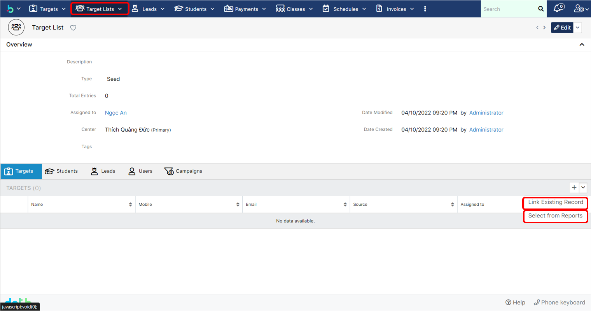

# Ghi nhận phản hồi

> Bước 1: Tại màn hình Trang chủ, để phản hồi với Trung tâm, click vào chức năng Trao đổi:

> Bước 2: Lựa chọn Loại yêu cầu:


Ghi chú: 

* Loại yêu cầu: 

- Xin nghỉ phép \(Học viên trao đổi với Trung tâm về việc vắng học\).

- Hỏi lịch học \(Học viên trao đổi với Trung tâm về vấn đề Lịch học\).

- Hỏi học phí \(Học viên trao đổi với Trung tâm về vấn đề Học phí\).

- Khác \(Những trao đổi khác với 3 nội dung trên\).


> Bước 3: Nhập chủ đề và nội dung cần trao đổi, sau đó nhấn Gửi.

> Bước 4: Click vào ô Yêu cầu của bạn để theo dõi những nội dung Trao đổi của mình với Trung tâm:

> Bước 5: Màn hình hiển thị những trao đổi với Trung tâm và trạng thái của :


Ghi chú:

- Đã tiếp nhận: Nội dung Trao đổi đã được gửi đến Trung tâm.

- Đang xử lý: Nội dung Trao đổi đang được Trung tâm xử lý và phản hồi.

- Đã giải quyết: Nội dung Trao đổi đã hoàn tất.



Ngoài ra, sau khi gửi trao đổi và Trung tâm gửi phản hồi, ta sẽ nhận được tại phần thông báo như sau:

* Click vào nút hình chuông:

  

* Xem thông báo phản hồi về các nội dung Trao đổi:  


