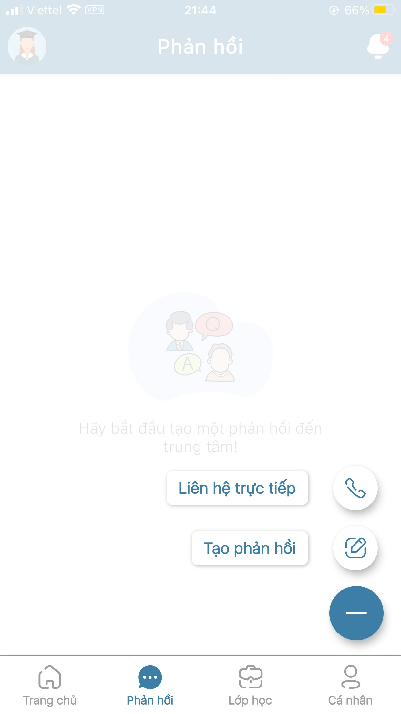

# Ghi nhận phản hồi

> Bước 1: Tại màn hình Trang chủ, click vào chức năng Phản hồi để phản hồi về trung tâm.

> Bước 2: Click vào biểu tượng dấu cộng góc phải dưới cùng để tạo mới Phản hồi.

> Bước 3: Chọn 1 trong 2 loại Phản hồi cần thực hiện. Click chọn option Tạo phản hồi.


Ghi chú:

1. Liên hệ trực tiếp: Gọi điện trực tiếp đến hotline trung tâm.
2. Tạo phản hồi: Phản hồi dưới dạng gửi văn bản đến trung tâm



Ghi chú: 

* Loại yêu cầu: 

- Xin nghỉ phép \(Học viên trao đổi với Trung tâm về việc vắng học\).

- Hỏi lịch học \(Học viên trao đổi với Trung tâm về vấn đề Lịch học\).

- Hỏi học phí \(Học viên trao đổi với Trung tâm về vấn đề Học phí\).

- Khác \(Những trao đổi khác với 3 nội dung trên\).


> Bước 3: Nhập chủ đề và nội dung cần trao đổi, sau đó nhấn Gửi.

> Bước 4: Click vào ô Yêu cầu của bạn để theo dõi những nội dung Trao đổi của mình với Trung tâm.

> Bước 5: Màn hình hiển thị những trao đổi với Trung tâm và trạng thái của.


Ghi chú:

- Đã tiếp nhận: Nội dung Trao đổi đã được gửi đến Trung tâm.

- Đang xử lý: Nội dung Trao đổi đang được Trung tâm xử lý và phản hồi.

- Đã giải quyết: Nội dung Trao đổi đã hoàn tất.



Ngoài ra, sau khi gửi trao đổi và Trung tâm gửi phản hồi, ta sẽ nhận được tại phần thông báo như sau:

* Click vào nút hình chuông:

  

* Xem thông báo phản hồi về các nội dung Trao đổi:  


