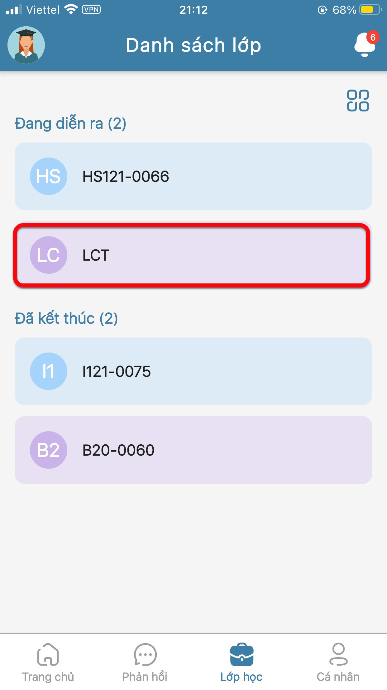
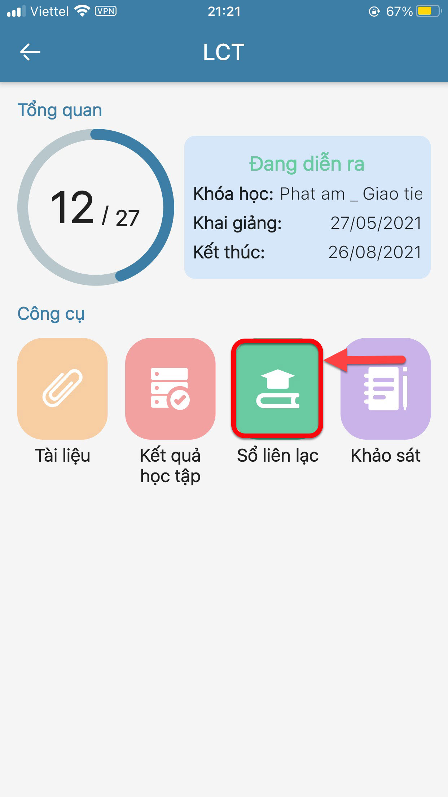
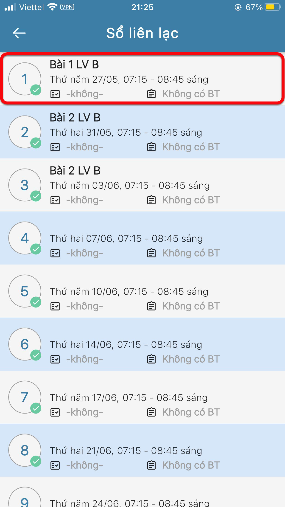

# Thông tin bài giảng và bài tập về nhà

> Bước 1: Tại màn hình Trang chủ, click vào tab Lớp học để theo dõi Thông tin bài giảng và bài tập về nhà của học viên theo lớp.

> Bước 2: Click chọn Lớp muốn xem thông tin theo Lớp.

> Bước 3: Click vào tính năng Sổ liên lạc để xem danh sách các buổi học, thông tin bài giảng, bài tập về nhà của lớp đó.

> Bước 4: Hiển thị danh sách các buổi học của Lớp. Click vào buổi học để xem chi tiết từng buổi học trong danh sách

> Bước 5: Ứng dụng hiển thị thông tin chi tiết bài giảng và bài tập về nhà của buổi học đó.

