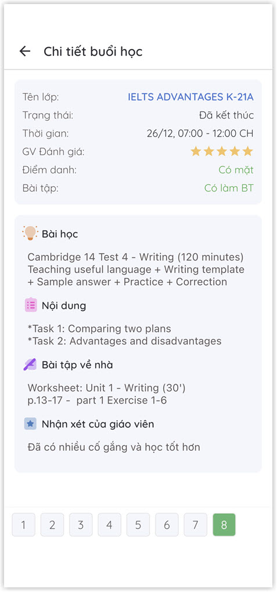
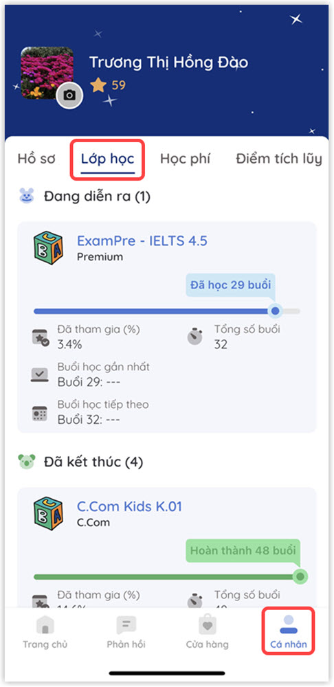
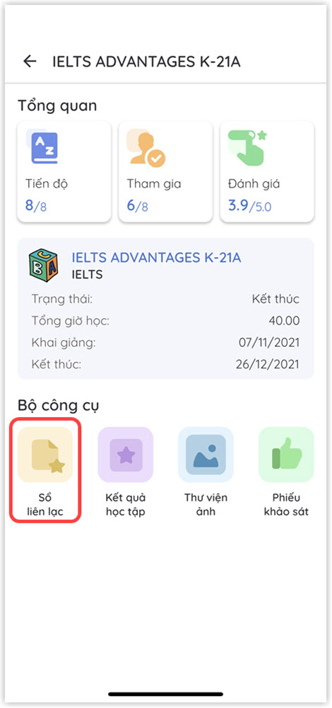

# Thông tin bài giảng và bài tập về nhà

#### Có thể thực hiện theo 2 cách sau:

#### CÁCH 1:

> **Bước 1**: Tại màn hình Trang chủ, click vào chức năng Sổ liên lạc để theo dõi Thông tin bài giảng và bài tập về nhà của học viên theo lớp. &#x20;

> Bư**ớc 2:** Tại màn hình Chọn lớp. Click chọn lớp muốn xem thông tin.

> **Bước 3**: Hệ thống sẽ hiển thị danh sách các buổi học của Lớp đó. Người dùng có thể lựa chọn một buổi học bất kì để xem thông tin chi tiết.

.jpg>)

> **Bước 4**: Ứng dụng sẽ hiển thị thông tin chi tiết bài giảng và bài tập về nhà của buổi học ngày hôm đó.

#### CÁCH 2:

> **Bước 1**: Tại màn hình Cá nhân, Click chọn tab Lớp học để hiện thị danh sách lớp mà học viên đã tham dự.&#x20;

> **Bước 2**: Lựa chọn lớp học muốn xem thông tin chi tiết như hình bên dưới.

.jpg>)

> **Bước 3:** Màn hình thông tin lớp học sẽ được hiển thị như hình bên dưới. Sau đó, chọn chức năng "Sổ liên lạc" để xem thông tin chi tiết về các buổi học.&#x20;

> **Bước 4:**  Hệ thống sẽ hiển thị danh sách các buổi học của Lớp đó. Người dùng có thể lựa chọn một buổi học bất kì để xem thông tin chi tiết.

.jpg>)

> **Bước 5:** Ứng dụng sẽ hiển thị thông tin chi tiết bài giảng và bài tập về nhà của buổi học ngày hôm đó.
