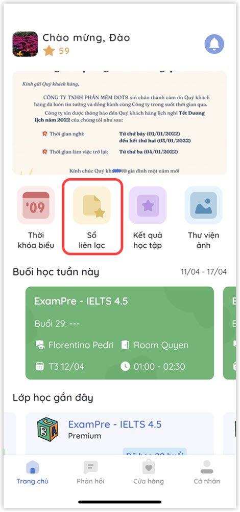
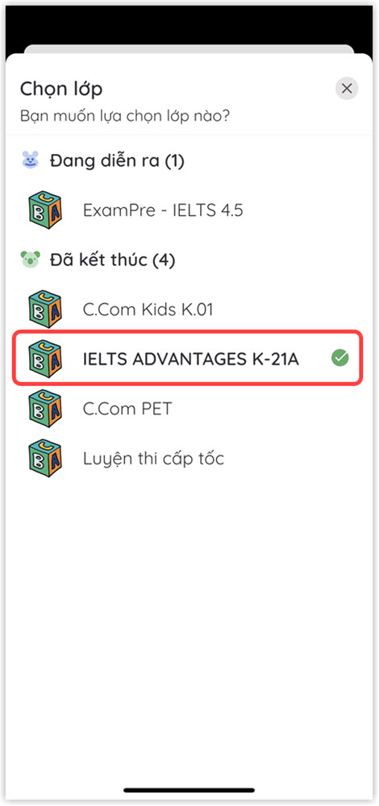
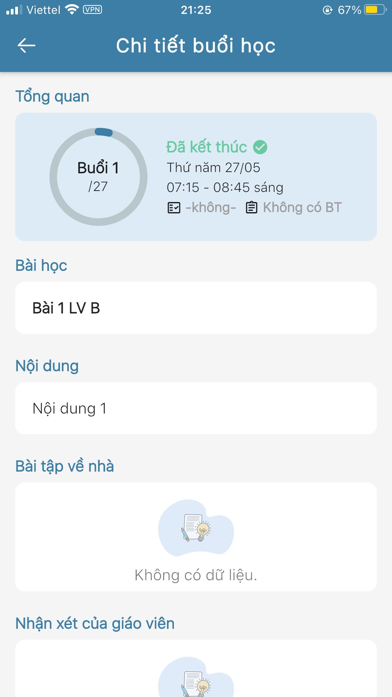

# Thông tin bài giảng và bài tập về nhà

> **Bước 1**: Tại màn hình Trang chủ, click vào chức năng Sổ liên lạc để theo dõi Thông tin bài giảng và bài tập về nhà của học viên theo lớp. &#x20;

> Bư**ớc 2:** Tại màn hình Chọn lớp. Click chọn lớp muốn xem thông tin.

> **Bước 3**: Hệ thống sẽ hiển thị danh sách các buổi học của Lớp. Người dùng có thể lựa chọn một buổi học bất kì để xem thông tin chi tiết về buổi học đó.

.jpg>)

> Bước 5: Ứng dụng hiển thị thông tin chi tiết bài giảng và bài tập về nhà của buổi học đó.

