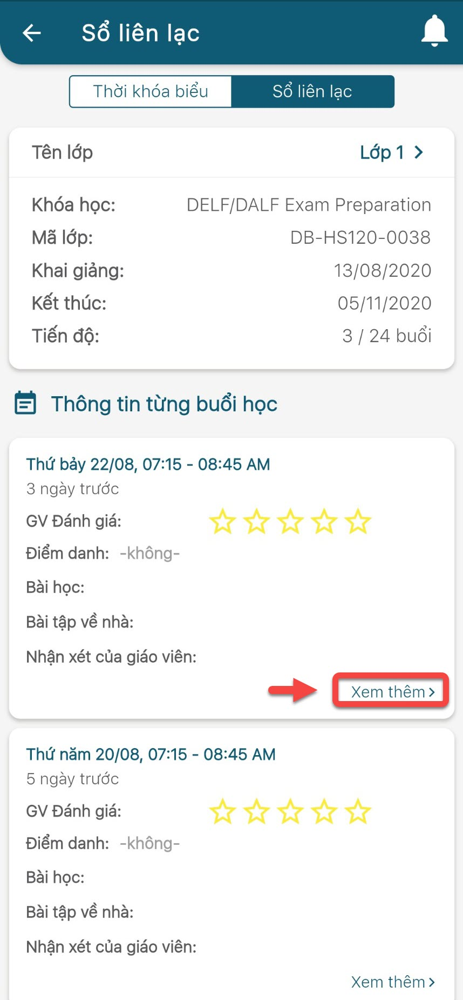
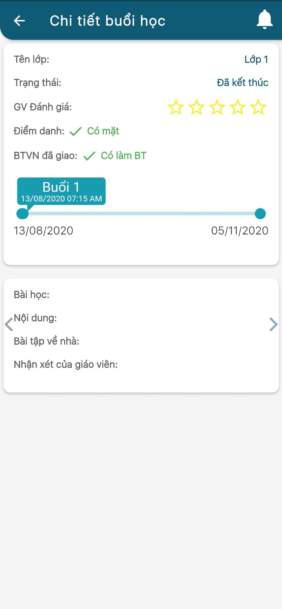

# Thông tin bài giảng và bài tập về nhà

> Bước 1: Tại màn hình Trang chủ, click vào chức năng Lịch học để theo dõi Thông tin bài giảng và bài tập về nhà của học sinh.

> Bước 2: Click vào Danh sách để xem danh sách liệt kê các buổi học, thông tin bài giảng và bài tập về nhà.

> Bước 3: Xem chi tiết khi click xem thêm vào từng buổi học trong danh sách.

> Bước 4: Ứng dụng hiển thị thông tin chi tiết bài giảng và bài tập về nhà của buổi học đó.

