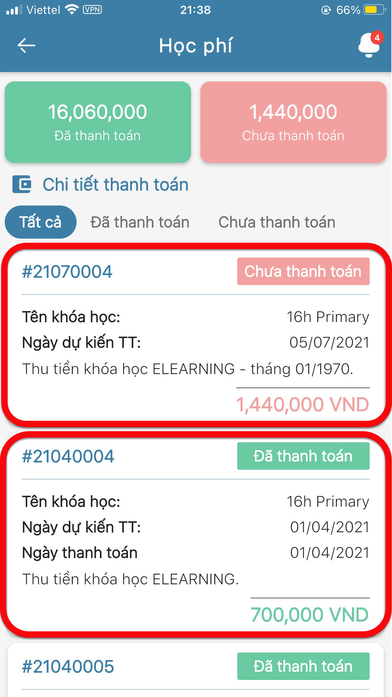
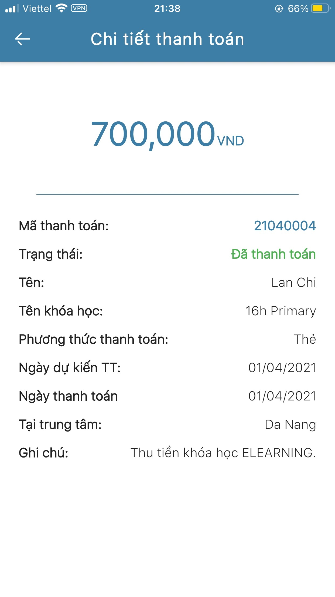

# Lịch sử khoản thu

> Bước 1: Tại màn hình Trang chủ, click vào chức năng Học phí để theo dõi lịch sử các khoản thu của học viên.

> Bước 2: Ứng dụng sẽ hiển thị danh sách các khoản thu đã thanh toán hoặc chưa thanh toán, khóa học và ngày thanh toán,... Click vào khoản thu để xem chi tiết.

> Bước 3: Ứng dụng hiển thị thông tin chi tiết về khoản thu.

