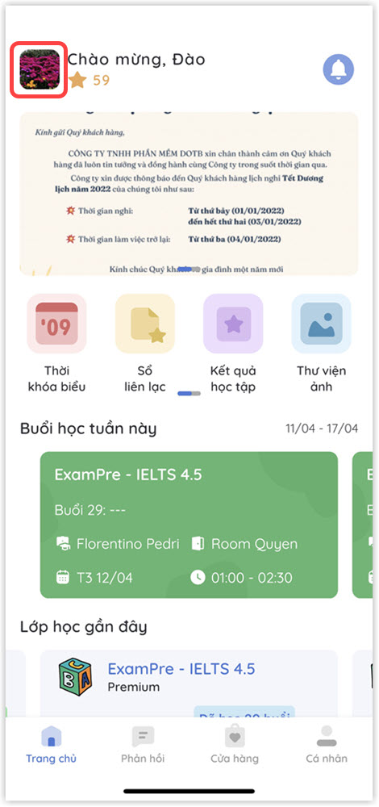

# Lịch sử khoản thu

> **Bước 1:** Truy cập tính năng **Học phí** trên ứng dụng. Có thể thực hiện theo 2 cách sau::
>
> **-> Cách 1:**
>
> * Click vào **avatar** của học viên để hiển thị danh sách chức năng trên ứng dụng.

> * Tiếp theo, nhấp vào chức năng **Học phí** để theo dõi lịch sử các khoản thu của học viên.

> * &#x20;**** Ứng dụng sẽ hiển thị danh sách các khoản thu **"Đã thanh toán"** hoặc **"Chưa thanh toán"** của học viên, khóa học và ngày thanh toán,... Click vào khoản thu bất kỳ để xem chi tiết.

> \-> **Cách 2:**&#x20;
>
> * Tại màn hình Cá nhân, click vào chức năng **Học phí** để xem thông tin các khoản thu của học viên.

> * Ứng dụng sẽ hiển thị danh sách các khoản thu **"Đã thanh toán"** hoặc **"Chưa thanh toán"** của học viên, khóa học và ngày thanh toán,... Click vào khoản thu bất kỳ để xem chi tiết.

.jpg>)

> **Bước 2:** Ứng dụng hiển thị thông tin chi tiết về khoản thu.

