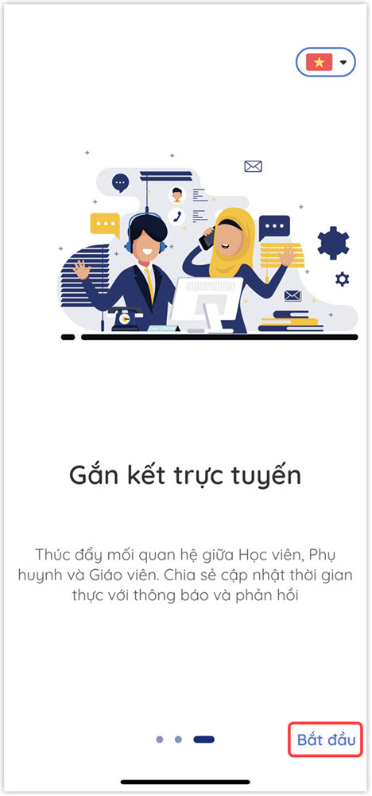
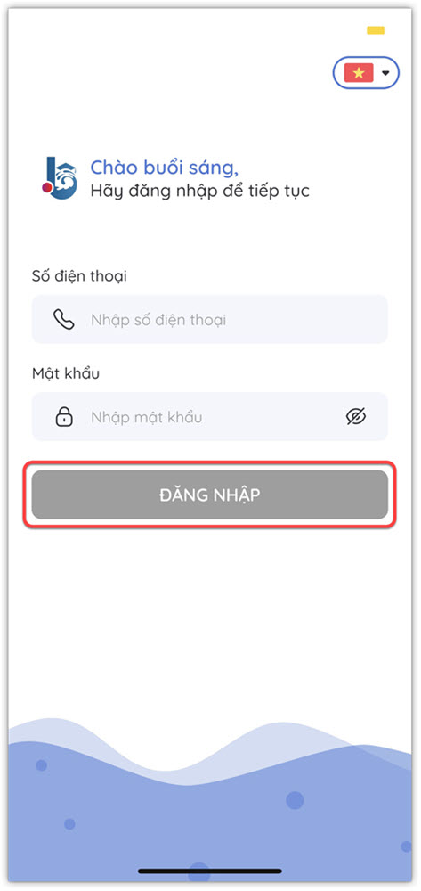

# Đăng nhập ứng dụng

> **Bước 1:** Tải ứng dụng Mobile DotB SEA tại đây:

:point\_right: Đối với người dùng Android:  

:point\_right: Đối với người dùng IOS:  &#x20;

> **Bước 2:** Mở ứng dụng **DotB SEA** trên Mobile và Click vào ô Bắt đầu trên màn hình.

> **Bước 3:** Lựa chọn vai trò là **"Học viên/Phụ huynh"** sau đó Click vào ô **Tiếp theo** trên màn hình

.jpg>)

> **Bước 4**: Nhập Số điện thoại/Mật khẩu đã được cung cấp sẵn. (Đối với người dùng dùng thử, có thể đăng nhập với Số điện thoại/Mật khẩu là: demo/demo). Và tiến hành đăng nhập.

> **Bước 5**: Đăng nhập thành công, ứng dụng sẽ hiển thị màn hình **Trang chủ** như hình bên dưới:

.jpg>)

