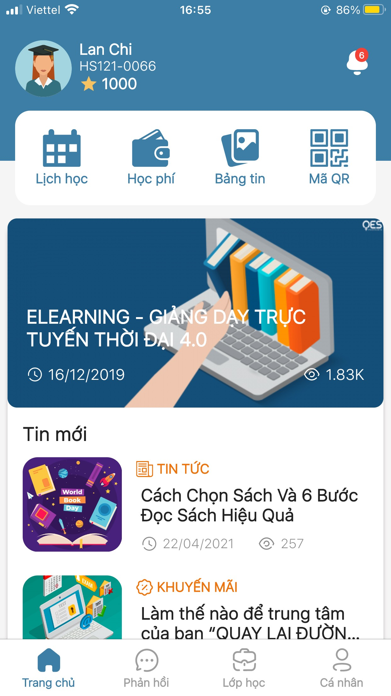

# Đăng nhập ứng dụng

> Bước 1: Tải ứng dụng Mobile DotB SEA tại đây:

:point_right: Đối với người dùng Android:  [.png>) ](https://play.google.com/store/apps/details?id=vn.dotb.sea)

:point_right: Đối với người dùng IOS:  [.png>)](https://apps.apple.com/vn/app/dotb-crm/id1475488445) 

> Bước 2: Mở ứng dụng DotB SEA trên Mobile và Click vào ô Bắt đầu trên màn hình.

> Bước 3: Chọn Trung tâm, nhập Số điện thoại/Mật khẩu đã được cung cấp sẵn. (Đối với người dùng dùng thử, có thể đăng nhập với Số điện thoại/Mật khẩu là: demo/demo). Và tiến hành đăng nhập.

> Bước 4: Đăng nhập thành công, ứng dụng sẽ hiển thị màn hình Trang chủ như hình bên dưới:

