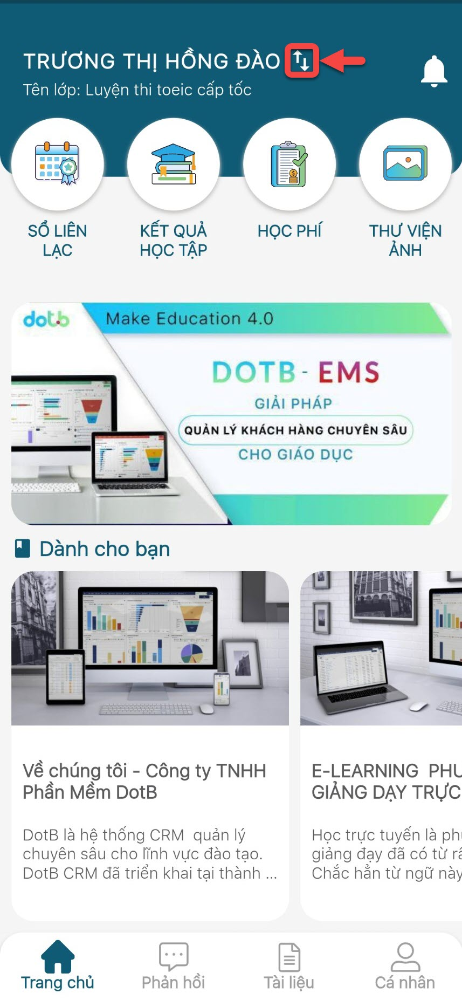
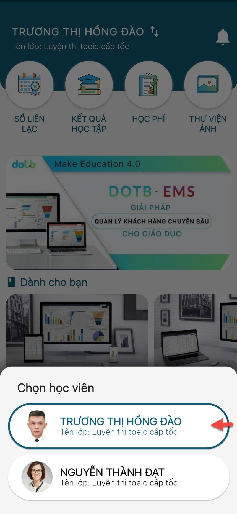
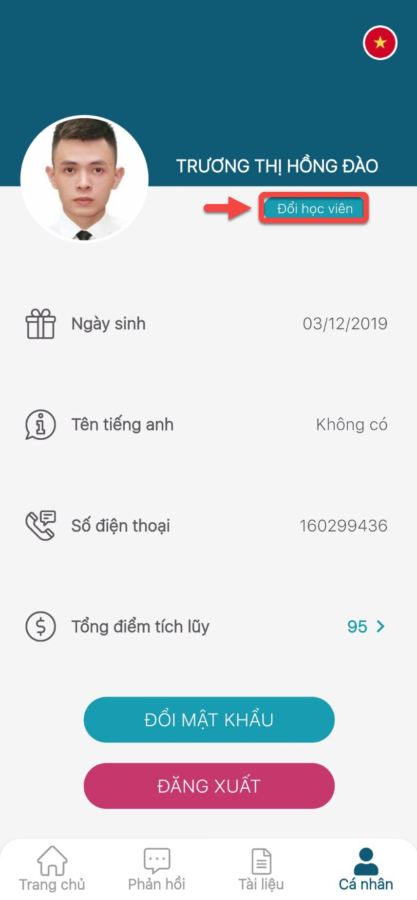
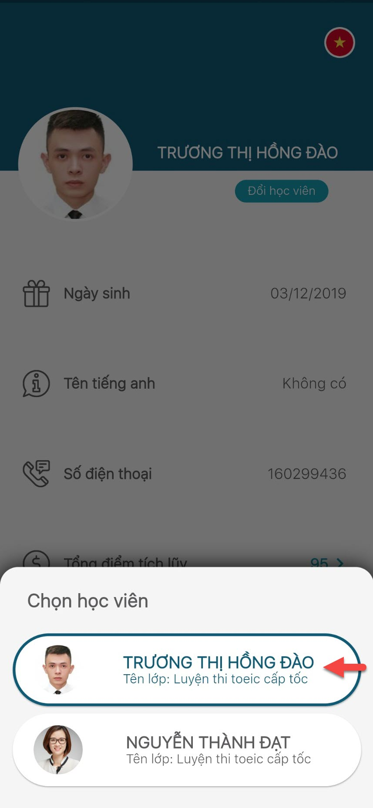

# Quản lí tài khoản

> Bước 1: Tại màn hình Trang chủ, click vào mũi tên để chọn học viên mà phụ huynh muốn xem thông tin học tập.

> Bước 2: Lựa chọn tài khoản học viên để xem thông tin.

> Bước 3: Hoặc Phụ huynh có thể vào trang **Cá Nhân** của bé, phụ huynh click chọn mục **Đổi Học Viên**

> Bước 4: App củng sẽ hiển thị ra thông tin các bé , sau đó phụ huynh click chọn thông tin bé cần xem.

