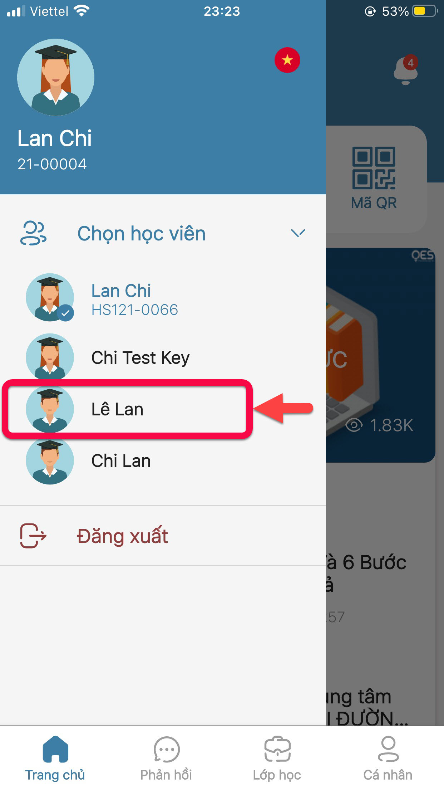

# Quản lí tài khoản

> Bước 1: Tại màn hình Trang chủ, click vào icon avatar để chọn học viên mà phụ huynh muốn xem thông tin học tập.

> Bước 2: App sẽ hiển thị danh sách các học viên. Click lựa chọn tài khoản học viên để xem thông tin.

