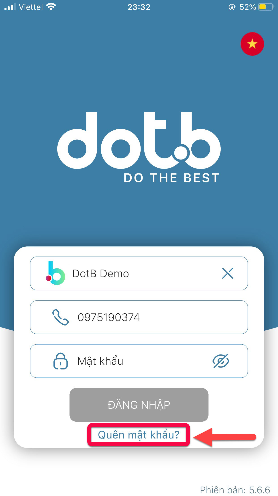
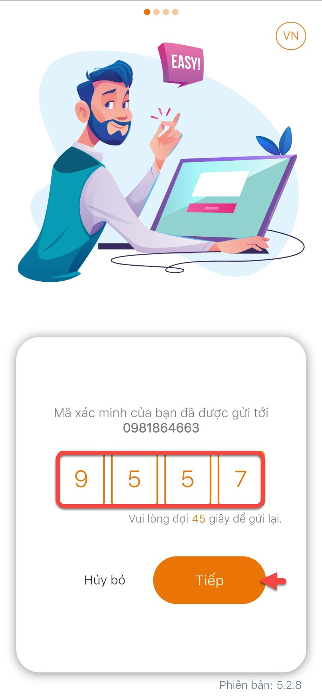
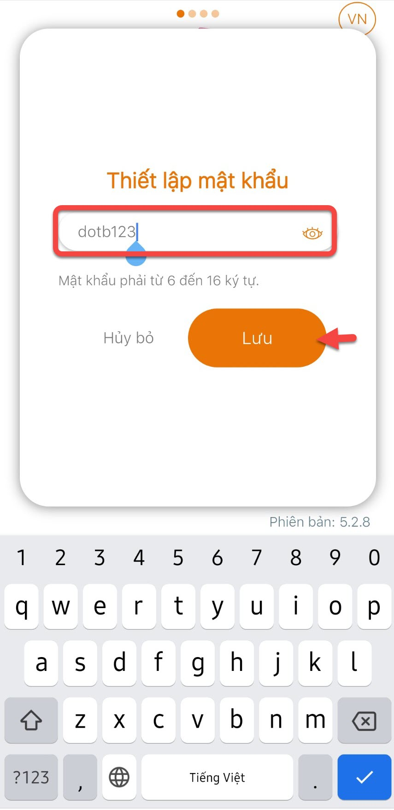

# Quên mật khẩu

> Bước 1 : Nếu phụ huynh quên mật khẩu đăng nhập, Phụ huynh click vào ô **Quên Mật Khẩu .**

> Bước 2: Sau đó nhập số điện thoại của phụ huynh vào để hệ thống gửi mã xác thực, tiếp theo click vào nút **Gửi**.

.jpg>)

> Bước 3: Sau khi click nút **Gửi , t**rong 60 hệ thống sẽ gửi mã xác thực (mã code) cho Phụ Huynh, sau đó Phụ huynh chỉ cần nhập vào 4 ô như hình, nếu nhập đúng thì nút màu vàng **"Tiếp"** sẽ hiện ra, Phụ huynh click vào nú**t Tiếp.**

> Bước 4: Sau đó Phụ Huynh đặt lại mật khẩu và click **Lưu.** App sẽ quay về màn hình đăng nhập, lúc này Phụ huynh đăng nhập với mật khẩu mới vừa được đặt lại là được.

