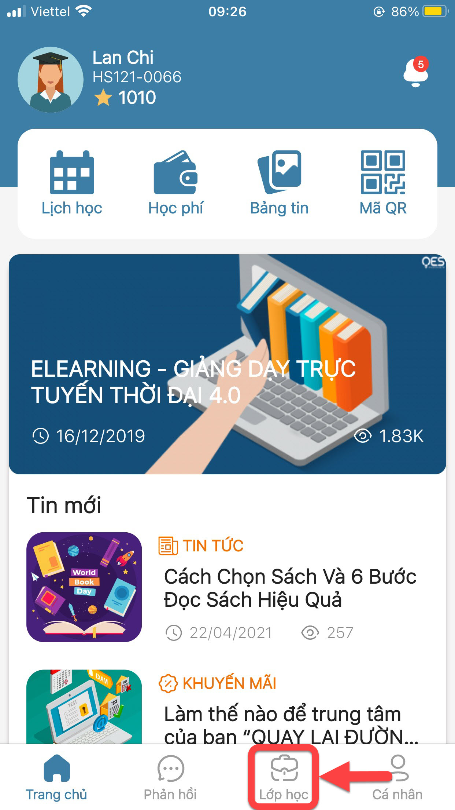
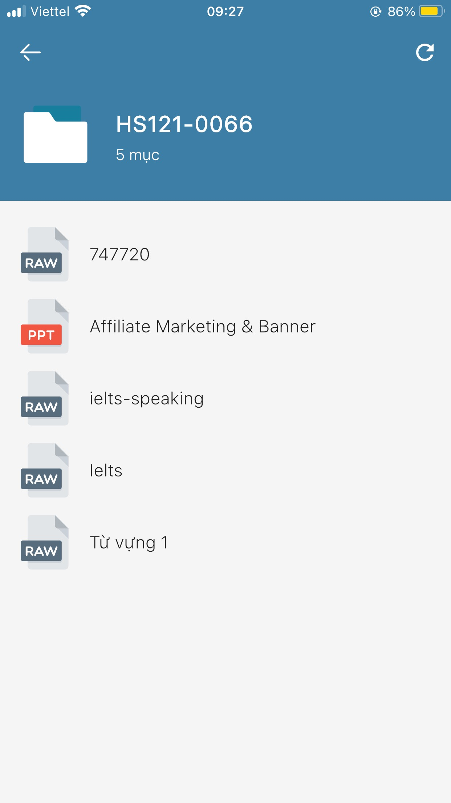

# Tài liệu học tập

> Bước 1: Tại màn hình Trang chủ, click vào chức năng Lớp học để theo dõi tài liệu học tập của học sinh theo từng Lớp học.

> Bước 2: Click vào Lớp muốn xem tài liệu học tập của lớp đó.

.jpg>)

> Bước 3: Click chọn thư mục Tài liệu để xem các tài liệu học tập được upload.

.jpg>)

> Bước 4: Ứng dụng hiển thị các tài liệu học tập: hình ảnh, powerpoint, file nghe... 

