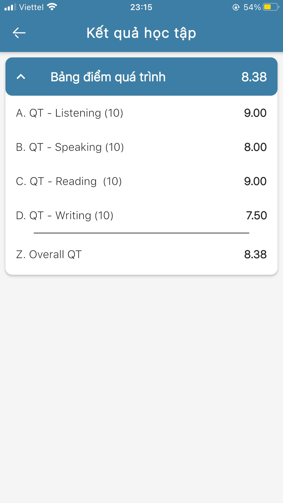

# Xem kết quả học tập

> Bước 1: Tại màn hình Trang chủ, click chọn tính năng Lớp học.

.jpg>)

> Bước 2: Click chọn vào lớp muốn xem kết quả học tập.

.jpg>)

> Bước 3: Click vào tính năng Kết quả học tập để xem kết quả học tập.

.jpg>)

> Bước 4: Ứng dụng sẽ hiển thị kết quả học tập của học viên trong lớp học đó. 

