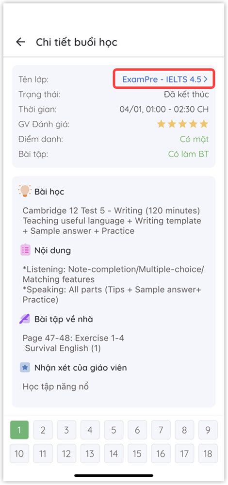
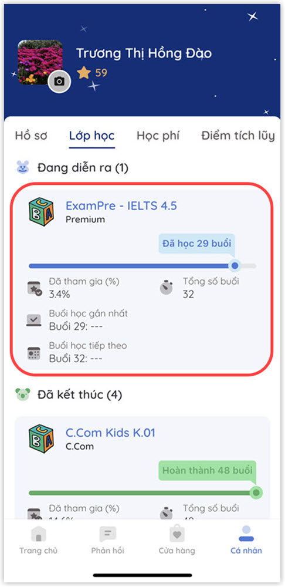

# Thông tin lớp học

### Có thể thực hiện theo 2 cách sau:&#x20;

### CÁCH 1: ****&#x20;

> **Bước 1:** Trong màn hình thông tin chi tiết buổi học, **** nhấn chọn vào tên lớp để hiện thông tin chi tiết.

> **Bước 2:** Màn hình thông tin chi tiết lớp học sẽ được hiển thị như hình bên dưới.

.jpg>)


**Ghi chú**

* **Tổng quan:** Hiển thị thông tin tổng quan về quá trình học của học viên (Bao gồm: Tiến độ học tập, Số lượng buổi học đã tham gia, Ngày khai giảng, Ngày bế giảng,...).
* **Bộ công cụ:** Danh sách các chức năng quản lý học viên.&#x20;


### **CÁCH 2:**&#x20;

> **Bước 1:** Tại màn hình **Cá nhân**, nhấn chọn tab **Lớp học** để hiển thị danh sách lớp mà học viên đã tham dự.&#x20;

> **Bước 2:** Lựa chọn lớp học muốn xem thông tin chi tiết như hình bên dưới.

> **Bước 3:** Màn hình thông tin chi tiết lớp học sẽ được hiển thị như hình bên dưới.

.jpg>)


**Ghi chú**

* **Tổng quan:** Hiển thị thông tin tổng quan về quá trình học của học viên (Bao gồm: Tiến độ học tập, Số lượng buổi học đã tham gia, Ngày khai giảng, Ngày bế giảng,...).
* **Bộ công cụ:** Danh sách các chức năng quản lý học viên.&#x20;

