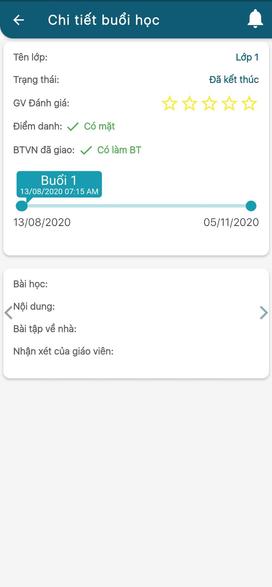

# Thông tin Thời khóa biểu

> Bước 1: Tại màn hình Trang chủ, click vào chức năng Lịch học để theo dõi Thời khóa biểu của học viên.

> Bước 2: Click vào để lựa chọn buổi học tương ứng cần xem chi tiết.


**Ghi chú**:

* Màu xám: Buổi học đã kết thúc.
* Màu xanh: Buổi học chưa bắt đầu.
* Click vào ô hình chữ nhật: Thông tin lịch học hệ thống sẽ show ra chi tiết lịch học buổi đó.


> Bước 3: Ứng dụng hiển thị thông tin chi tiết của buổi học đó.

