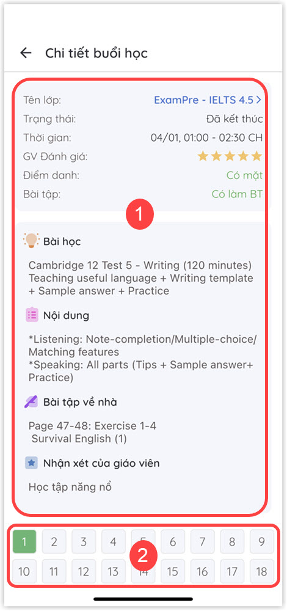

# Thông tin Thời khóa biểu

> **Bước 1:** Truy cập chức năng Thời khóa biểu&#x20;
>
> **-> Cách 1**_**:**_** **&#x20;
>
> * Tại màn hình **Trang chủ**, nhấn vào chức năng **Thời khóa biểu** để theo dõi Thời khóa biểu của học viên.

.jpg>)

> **-> Cách 2**_**:**_&#x20;
>
> * Tại màn hình **Trang chủ**, nhấn vào **ảnh dại diện** người dùng để hiển thị danh sách chức năng trên ứng dụng.

.jpg>)

> * Sau đó chọn chức năng **Thời khóa biểu.**

 (1).jpg>)

> **Bước 2**: Chọn vào để lựa chọn buổi học tương ứng cần xem chi tiết.

 (1).jpg>)


**Ghi chú**:

* **Màu xám**: Buổi học đã kết thúc.
* **Màu xanh**: Buổi học chưa bắt đầu.
* **Thẻ "Tuần"**: Hiển thị lịch học theo tuần hiện tại.
* **Thẻ "Tháng":** Hiển thị lịch học theo tháng hiện tại.
* &#x20;**Thông tin lịch học:** Khi chọn sẽ hiển thị thông tin chi tiết về buổi học ngày hôm đó.


> **Bước 3**: Ứng dụng hiển thị thông tin chi tiết của buổi học đó.


**Ghi chú**:

* **(1):** Thông tin chi tiết về buổi học (Thông tin bài giảng, bài tập về nhà, điểm danh,...).
* **(2):** Danh sách các buổi học (Có thể chọn để hiển thị thông tin chi tiết về buổi học đó).&#x20;

