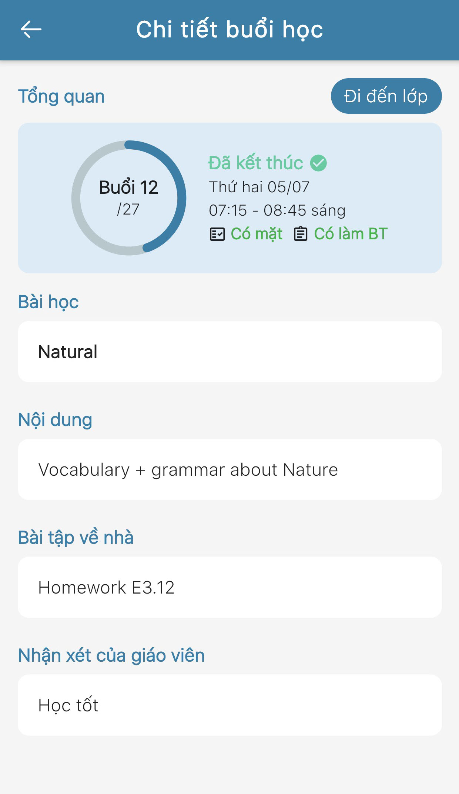

# Thông tin Thời khóa biểu

> **Bước 1:** Truy cập chức năng Thời khóa biểu&#x20;
>
> _Cách 1:_ Tại màn hình Trang chủ, Click vào chức năng Thời khóa biểu để theo dõi Thời khóa biểu của học viên.

.jpg>)

> _Cách 2:_ Tại màn hình Trang chủ, Click vào ảnh dại diện người dùng để hiển thị danh sách chức năng trên ứng dụng.

.jpg>)

> Sau đó chọn chức năng Thời khóa biểu.

.jpg>)

> **Bước 2**: Click vào để lựa chọn buổi học tương ứng cần xem chi tiết.

.jpg>)


**Ghi chú**:

* Màu xám: Buổi học đã kết thúc.
* Màu xanh: Buổi học chưa bắt đầu.
* Thẻ "Tuần": Hiển thị lịch học theo tuần hiện tại
* Thẻ "Tháng": Hiển thị lịch học theo tháng hiện tại
* Click vào ô hình chữ nhật: Thông tin lịch học hệ thống sẽ show ra chi tiết lịch học buổi đó.


> **Bước 3**: Ứng dụng hiển thị thông tin chi tiết của buổi học đó.

