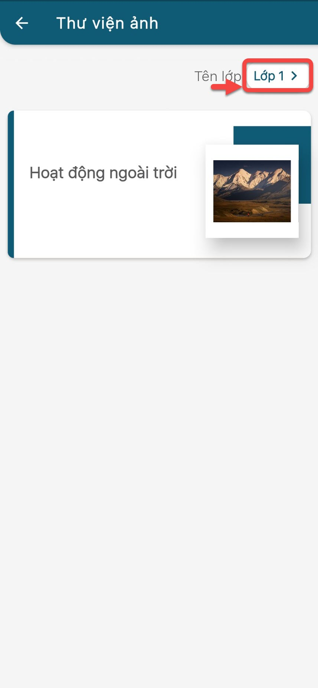
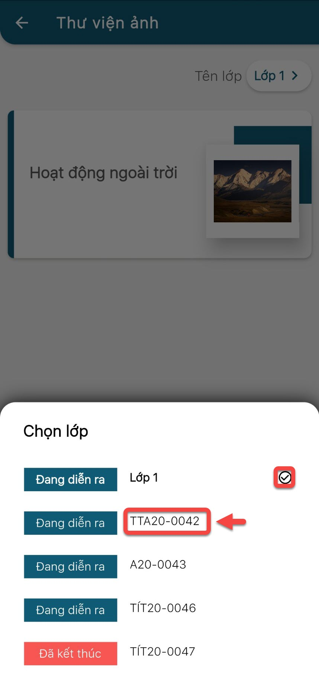

# Xem thư viện ảnh của học viên

> Bước 1: Tại màn hình Trang chủ, click vào **Thư Viện Ảnh** để xem hoạt động của học viên trong lớp.

> Bước 2: Click vào chọn lớp mà phụ huynh muốn xem hoạt động của bé.

> Bước 3: Chọn vào lớp cần xem ảnh.

> Bước 4: Hệ thống hiển thị thư viện ảnh của học viên.

