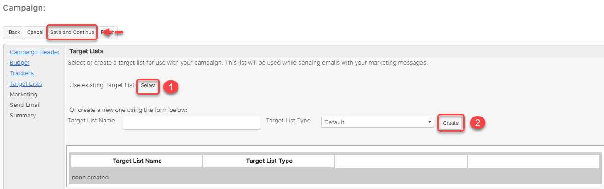
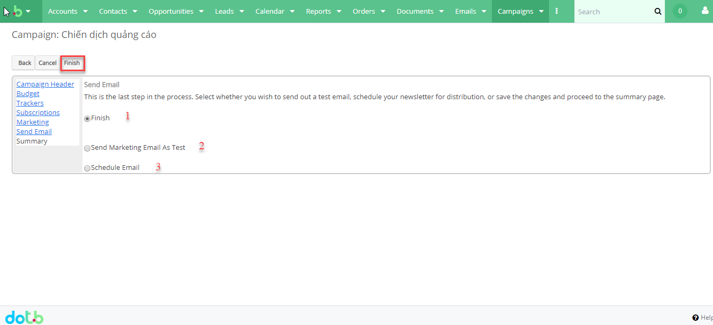
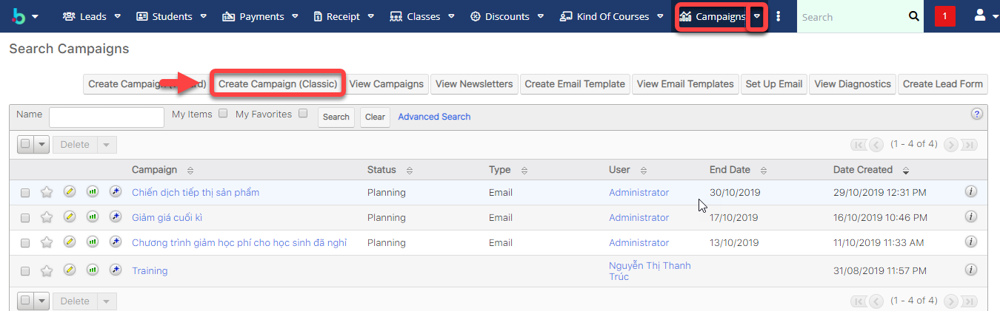
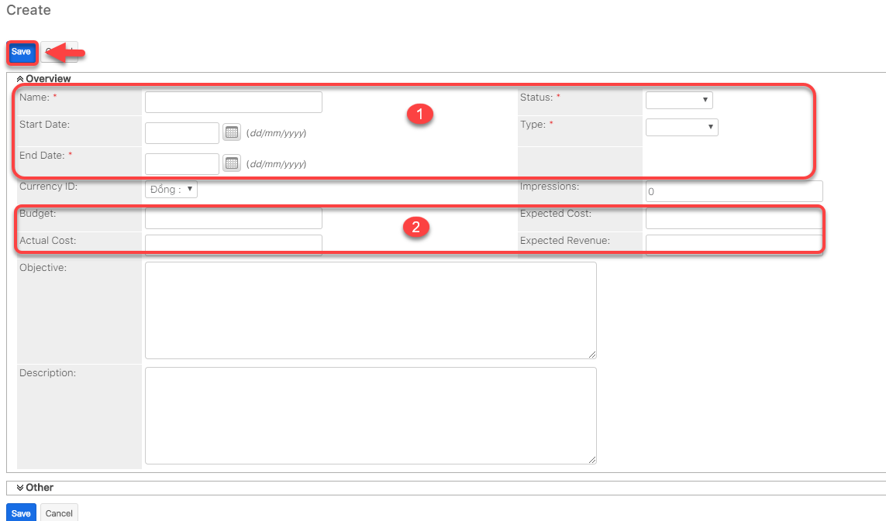
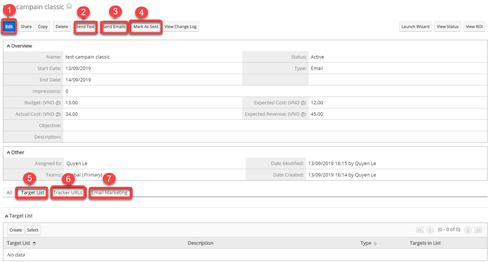

# Email Marketing

## 🌟 Campaigns

### Tạo Campaigns\(Wizard\)

> Bước 1: Đưa chuột vào Menu Campaign chọn Create Campaign \(Wizard\) hoặc click vào module Campaign để Create Campaign.

> Bước 2: Hệ thống hiển thị thông tin danh sách các chiến dịch ,tiến hành các hoạt động chạy chiến dịch như Newsletter, Email,… Ví dụ tạo Campaign loại email: click Email, sau đó click Start.


**Ghi chú**:

1. Newsletter: Gửi email dạng bản tin hàng tháng, tuần,..
2. Email: gửi emaik hàng loạt
3. Non-email based Campaigns: chiến dịch không dựa trên email. Ví dụ như quảng cáo, phát tờ rơi,..


> Bước 3: Nhập đầy đủ các thông tin, sau đó click Next để tiếp tục.

> Bước 4: Nhập ngân sách để tính ROI. Sau đó click Next

> Bước 5: Xác định URL theo dõi ở đây để sử dụng với chiến dịch này. Bạn phải nhập cả tên và URL để tạo trình theo dõi, tiếp tục click Create Tracker, sau đó click Next.


**Ghi chú**:

1.Tracker Name:Tên chiến dịch theo dõi

2.Tracker URL :Đường dẫn URL theo dõi chiến dịch

3.Create Tracker :Tạo trình  theo dõi 

4.Link để nhận biết khách hàng không quan tâm đến mail của mình \(lần sau không gửi cho danh sách khách hàng có Tên trong Remove Me\)


> Bước 6: Chọn hoặc tạo danh sách mục tiêu \(Target list\) sử dụng với chiến dịch. Email sẽ được gửi đến danh sách này, bấm Create. Sau đó click Save and Continue.


Ghi chú:

1.Select : Chọn Danh sách mục tiêu tồn tại trong hệ thống 

2.Create: Tạo danh sách mục tiêu mới để gửi Email


> Bước 7: Cấu hình thời gian gửi Email Marketing, nhập đầy đủ thông tin sau đó click Next.


**Ghi chú**:

1: Nhập tên Email Marketing

2: Tài khoản gửi Email

3: Tên tài khoản gửi Email

4: Tên trả lời Email

5: Danh sách chiến lược gửi Email Marketing

6: Trạng thái của Email Marketing

7: Ngày và thời gian gửi Email \(Lập lịch gửi Email\)

8: Địa chỉ gửi Email

9: Tên địa chỉ trả lời Email 

10: Mẫu Email Marketing \(Có thể tạo mới hoặc chỉnh sửa mẫu Email này-Phần 3\)


> Bước 8:  Đây là bước cuối cùng. Chọn xem bạn có muốn gửi email dạng kiểm tra hoặc lập lịch gửi email \(Phần 4\) hoặc bạn chọn finish và có thể lên lịch gửi email sau và tiếp tục đến trang tổng quan.


Ghi chú:

1: Finish:hoàn  tất thông tin chạy chiến dich

2: Gửi chiến dịch dạng Test 

3: Lập lịch gửi Email \(Phần 4\)


### Tạo Campaigns \(Classic\)

> Bước 1: Đưa chuột vào Menu Campaign chọn Create Campaign \(Classic\) hoặc click vào module Campaign để Create Campaign.

> Bước 2: Nhập đầy đủ các thông tin của chiến dịch, sau đó nhấn Save để hoàn tất.



**Ghi chú:**

1.Thông tin chiến dịch \(Ngày bắt đầu,kết thúc,trạng thái,…\)

2. Nhập ngân sách để tính ROI.


> Bước 3: Sau khi Lưu thành công chiến dịch loại Classic ,tiếp theo tạo Target List,Tracker,Email Makerting \(Tương tự Campaign Wizard\).Cuối cùng lập lịch gửi Email click vào Send Email/Test \(nếu muốn\).


**Ghi chú**:

1:Chỉnh sửa chiến dịch

2:Gửi chiến dịch để test

3:Gửi Email

4:Đánh dấu là đã gửi Email

5:Tạo danh sách target

6:Tạo Tracker URL 

7:Tạo mẫu Email Marketing


## Target Lists

Tạo danh sách người nhận email/sms của chiến dịch Marketing từ nhiều nguồn

> Bước 1: Đưa chuột vào Menu Target List chọn Create Target List.

> Bước 2: Tại màn hình Target List, nhập đầy đủ các thông tin cần thiết, Sau đó Click Save để Hoàn tất việc tạo ra 1 danh sách Target mới.

> Bước 3: Hệ thống hiển thị thông tin chi tiết của Target List được tạo.Sau đó chọn Link Existing Report hoặc Select from Reports để import khách hàng vào Target List.


**Ghi chú**:

1:Link tới khách hàng thô \(Target/Lead\) 

2:Chọn từ báo cáo


> Bước 4: Ví dụ : chọn Link existing report ,hệ thống sẽ chuyển qua màn hình bên dưới, sau đó chọn khách hàng tiềm năng cho danh sách mới tạo \(Target List\),cuối cùng nhất Add

> Bước 5: Hệ thống hiển thị thông tin chi tiết của Target List đã import khách hàng vào hệ thống.

## 📝 Email Template

> Bước 1: Đưa chuột vào Menu Email chọn Create Email Template.

> Bước 2: Tại màn hình tới mới mẫu Email Template,nhập/chỉnh sửa đầy đủ thông tin cần thiết, sau đó click vào nút Save.


**Ghi chú**:

1:Tên Template

2:Loại Template \(Email,Campaign ,SMS\)

3:Chèn biến :Tên,Loại,Địa chỉ,…

4:Tiêu đề của Template

5:Nội dung Template 6:Đính kèm theo tệp \(Nếu có\)


> Bước 3: Hệ thống hiển thị thông tin mẫu Email Template vừa được tạo.

## 🕑 Lập lịch gửi Email

> Bước 1: Đưa chuột vào Menu Campaign s chọn View Campaign s ,sau đó chọn chiến dịch muốn lập lịch gửi Email.

> Bước 2: Click Launch Wizard.

> Bước 3: Click Schedule Email.

> Bước 4: Hệ thống thông báo Lịch gửi email đã được bật.

> Bước 5: Tiếp theo vào Admin->Email Queue.

> Bước 6: Hệ thống hiển thị danh sách người được lập lịch gửi Email \(bạn củng có thể gửi mà không cần lên lịch\),bạn có thể chọn tất cả hoặc chọn một số người có trong danh sách ,sau đó nhấn nút Send Queued Campaign Emails để gửi chiến dịch.


**Ghi chú:**

1:Ngày gửi \(Ngày và thời gian lên lịch gửi Email\)

2:Chọn tất cả để gửi email chiến dịch

3: Chọn một số người có trong danh sách để gửi email chiến dịch 

4:Click vào Send Queued Campaign  Emails để gưi chiến dịch


## 📈 Xem báo cáo hiệu quả Campaigns

> Bước 1: Đưa chuột vào module Campaigns chọn View Campaign s ,sau đó chọn chiến dịch muốn xem hiệu quả Email Marketing.

> Bước 2: Click chọn View Status.

> Bước 3: Hệ thống sẽ hiển thị chi tiết số người đã đọc email,mở link,số người nhận,email bị trả về,…


**Ghi chú**:

1 : Filter biểu đồ danh sách chiến dịch email

2 : Danh sách người gửi tin nhắn trong hàng đợi \(đang chờ lập lịch gửi,hoặc chờ gửi\)

3 : Danh sách người gửi tin nhắn đã được gửi đi

4 : Danh sách người xem tin nhắn

5 : Danh sách người click-thru linkClick để qua bước tiếp theo

6:Danh sách Leads được tạo

7:Danh sách Khách hàng được tạo

8:Danh sách Email không có giá trị

9:Danh sách Email bị trả lại 

10:Danh sách Email Opted out


