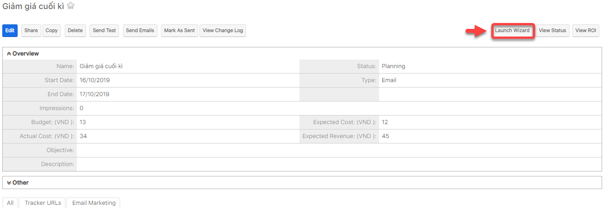

# Email Marketing

## :pencil:&#x20;

## :clock2: Lập lịch gửi Email

> **Bước 1:** Đưa chuột vào Menu Campaigns chọn View Campaigns ,sau đó chọn chiến dịch muốn lập lịch gửi Email.

> **Bước 2:** Nhấn vào Launch Wizard.

> **Bước 3:** Chọn Schedule Email.

> **Bước 4:** Hệ thống thông báo Lịch gửi email đã được bật.

> **Bước 5:** Tiếp theo vào Admin -> Email Queue.

> **Bước 6:** Hệ thống hiển thị danh sách người được lập lịch gửi Email (bạn cũng có thể gửi mà không cần lên lịch), bạn có thể chọn tất cả hoặc chọn một số người có trong danh sách, sau đó nhấn nút Send Queued Campaign Emails để gửi chiến dịch.


****:woman\_gesturing\_ok: **Ghi chú:**

1. Ngày gửi (Ngày và thời gian lên lịch gửi Email)
2. Chọn tất cả để gửi email chiến dịch
3. Chọn một số người có trong danh sách để gửi email chiến dịch&#x20;
4. Nhấn vào Send Queued Campaign  Emails để gửi chiến dịch


## :chart\_with\_upwards\_trend: Xem báo cáo hiệu quả Campaigns

> **Bước 1:** Đưa chuột vào module Campaigns chọn View Campaigns ,sau đó chọn chiến dịch muốn xem hiệu quả Email Marketing.

> **Bước 2:** Nhấn chọn View Status.

> **Bước 3:** Hệ thống sẽ hiển thị chi tiết số người đã đọc email, mở liên kết, số người nhận, email bị trả về,…


****:woman\_gesturing\_ok: **Ghi chú**:

1. Filter biểu đồ danh sách chiến dịch email
2. Danh sách người gửi tin nhắn trong hàng đợi (đang chờ lập lịch gửi,hoặc chờ gửi)
3. Danh sách người gửi tin nhắn đã được gửi đi
4. Danh sách người xem tin nhắn
5. Danh sách người click-thru link. Nhấn để qua bước tiếp theo
6. Danh sách Leads được tạo
7. Danh sách Khách hàng được tạo
8. Danh sách Email không có giá trị
9. Danh sách Email bị trả lại&#x20;
10. Danh sách Email Opted out

