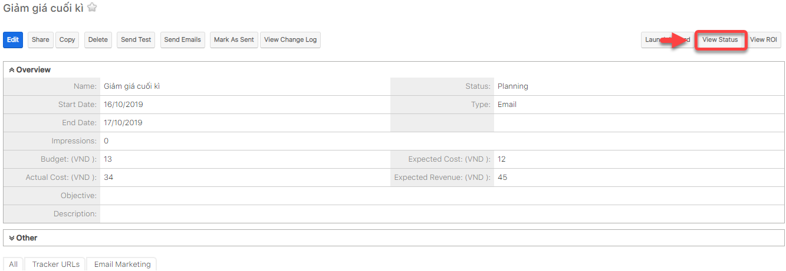

# Xem báo cáo Campaigns hiệu quả

> **Bước 1:** Đưa chuột vào module **Campaigns** chọn **View Campaigns**, sau đó chọn chiến dịch muốn xem hiệu quả Email Marketing.

<figure><figcaption></figcaption></figure>

> **Bước 2:** Nhấn chọn View Status.

> **Bước 3:** Hệ thống sẽ hiển thị chi tiết số người đã đọc email, mở liên kết, số người nhận, email bị trả về,…


****:woman\_gesturing\_ok: **Ghi chú**:

1. Filter biểu đồ danh sách chiến dịch email
2. Danh sách người gửi tin nhắn trong hàng đợi (đang chờ lập lịch gửi,hoặc chờ gửi)
3. Danh sách người gửi tin nhắn đã được gửi đi
4. Danh sách người xem tin nhắn
5. Danh sách người click-thru link. Nhấn để qua bước tiếp theo
6. Danh sách Leads được tạo
7. Danh sách Khách hàng được tạo
8. Danh sách Email không có giá trị
9. Danh sách Email bị trả lại&#x20;
10. Danh sách Email Opted out

