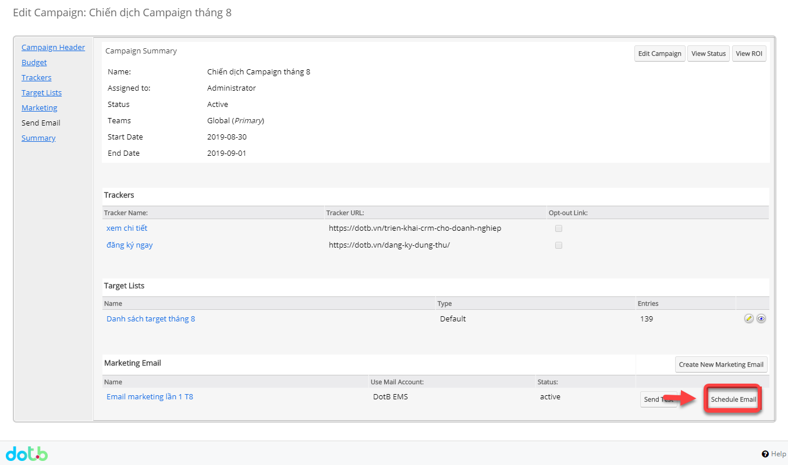
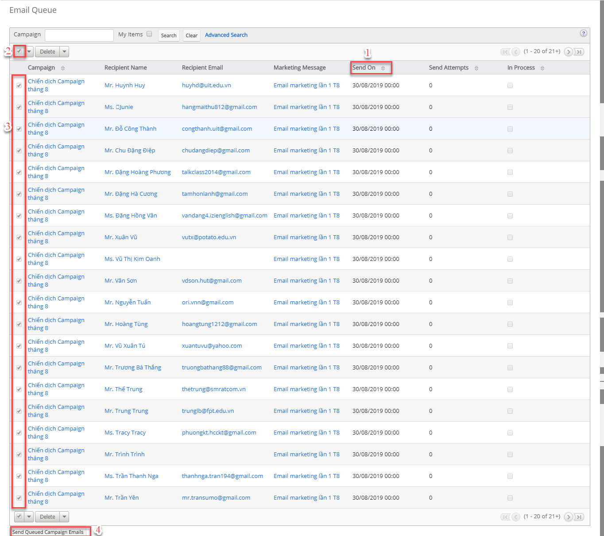

# Lập lịch gửi Email

> **Bước 1:** Đưa chuột vào Menu Campaigns chọn View Campaigns ,sau đó chọn chiến dịch muốn lập lịch gửi Email.

> **Bước 2:** Nhấn vào Launch Wizard.

> **Bước 3:** Chọn Schedule Email.

> **Bước 4:** Hệ thống thông báo Lịch gửi email đã được bật.

> **Bước 5:** Tiếp theo vào Admin -> Email Queue.

> **Bước 6:** Hệ thống hiển thị danh sách người được lập lịch gửi Email (bạn cũng có thể gửi mà không cần lên lịch), bạn có thể chọn tất cả hoặc chọn một số người có trong danh sách, sau đó nhấn nút Send Queued Campaign Emails để gửi chiến dịch.


****:woman\_gesturing\_ok: **Ghi chú:**

1. Ngày gửi (Ngày và thời gian lên lịch gửi Email)
2. Chọn tất cả để gửi email chiến dịch
3. Chọn một số người có trong danh sách để gửi email chiến dịch&#x20;
4. Nhấn vào Send Queued Campaign  Emails để gửi chiến dịch

