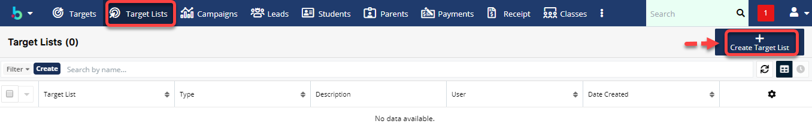

# Target Lists

> **Bước 1:** Đưa chuột vào Menu Target List chọn Create Target List.

> **Bước 2:** Tại màn hình Target List, nhập đầy đủ các thông tin cần thiết. Sau đó chọn Save để hoàn tất việc tạo ra 1 danh sách Target mới.

> **Bước 3:** Hệ thống hiển thị thông tin chi tiết của Target List được tạo. Sau đó chọn Link Existing Report hoặc Select from Reports để import khách hàng vào Target List.


****:woman\_gesturing\_ok: **Ghi chú**:

1. Link tới khách hàng (Targets/Leads/Students)&#x20;
2. Chọn từ báo cáo


> **Bước 4:** Ví dụ: Chọn Link existing report, hệ thống sẽ chuyển qua màn hình bên dưới, sau đó chọn khách hàng tiềm năng cho danh sách mới tạo (Target List), cuối cùng nhất Add.

> **Bước 5:** Hệ thống hiển thị thông tin chi tiết của Target List đã import khách hàng vào hệ thống.

